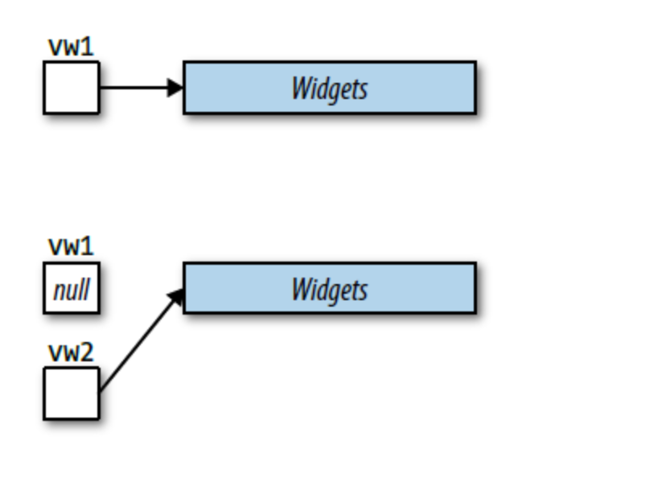

# Rvalue References, Move Semantics, and Perfect Forwarding

- 移动语义使编译器有可能用廉价的移动操作来代替昂贵的拷贝操作。正如拷贝构造函数和拷贝赋值操作符给了你控制拷贝语义的权力，移动构造函数和移动赋值操作符也给了你控制移动语义的权力。移动语义也允许创建只可移动（move-only）的类型，例如 std::unique_ptr，std::future 和 std::thread。

- 完美转发使接收任意数量实参的函数模板成为可能，它可以将实参转发到其他的函数，使目标函数接收到的实参与被传递给转发函数的实参保持一致。

但 std::move 并不移动任何东西，完美转发也并不完美。移动操作并不永远比复制操作更廉价；即便如此，它也并不总是像你期望的那么廉价。而且，它也并不总是被调用，即使在当移动操作可用的时候。构造“type&&”也并非总是代表一个右值引用。

在本章的这些小节中，非常重要的一点是要牢记形参永远是左值，即使它的类型是一个右值引用。比如，假设

```cpp
void f(Widget&& w);
```

形参 w 在这个函数中是一个左值，即使它的类型是一个 rvalue-reference-to-Widget

## Item23:理解 std::move 和 std::forward

为了了解 std::move 和 std::forward，一种有用的方式是从 **它们不做什么这个角度来了解它们。std::move 不移动（move）任何东西，std::forward 也不转发（forward）任何东西。** 在运行时，它们不做任何事情。它们不产生任何可执行代码，一字节也没有。

它们只是执行转换操作，std::move 无条件的将它的实参转换为右值，而 std::forward 只在特定情况满足时下进行转换。以下是一个 std::move 的示例实现：

```cpp
template<typename T>                            //在std命名空间
typename remove_reference<T>::type&&
move(T&& param)
{
    using ReturnType =                          //别名声明，见条款9
        typename remove_reference<T>::type&&;

    return static_cast<ReturnType>(param);
}

// c++14
template<typename T>                            //在std命名空间
decltype(auto) move(T&& param)
{
    using ReturnType =                          //别名声明，见条款9
        typename remove_reference<T>::type&&;

    return static_cast<ReturnType>(param);
}
```

std::move 接受一个对象的引用（准确的说，一个通用引用（universal reference），见[Item24](#item24区分通用引用与右值引用))，返回一个指向同对象的引用。

该函数返回类型的&&部分表明 std::move 函数返回的是一个右值引用，但是，正如 [Item28](#item28理解引用折叠) 所解释的那样，如果类型 T 恰好是一个左值引用，那么 T&&将会成为一个左值引用。为了避免如此，type trait（见 [traits](traits.md)）std::remove_reference 应用到了类型 T 上，因此确保了&&被正确的应用到了一个不是引用的类型上。这保证了 std::move 返回的真的是右值引用，这很重要，因为函数返回的右值引用是右值。因此，std::move 将它的实参转换为一个右值，这就是它的全部作用。**它只进行转换，不移动任何东西。**

std::move 并不能保证移动操作真正被执行，对于一个类，根据[Item41](tweaks.md)，声明一个值传递的形参：：

```cpp
class Annotation {
public:
    explicit Annotation(const std::string text)  //将会被复制的形参，如同条款41所说，值传递，因为只需要读取设置为const
    ：value(std::move(text))                     // 避免一次复制操作的代价
    {...}
};
private:
    std::string value;
```

这段代码可以编译，可以链接，可以运行。这段代码将数据成员 value 设置为 text 的值。这段代码与你期望中的完美实现的唯一区别，是 text 并不是被移动到 value，而是被拷贝。诚然，text 通过 std::move 被转换到右值，但是 text 被声明为 const std::string，所以在转换之前，text 是一个左值的 const std::string，而转换的结果是一个右值的 const std::string，但是纵观全程，const 属性一直保留。

当编译器决定哪一个 std::string 的构造函数被调用时，考虑它的作用，将会有两种可能性：

```cpp
class string {                  //std::string事实上是
public:                         //std::basic_string<char>的类型别名
    …
    string(const string& rhs);  //拷贝构造函数
    string(string&& rhs);       //移动构造函数
    …
};
```

std::move(text)的结果是一个 const std::string 的右值。这个右值不能被传递给 std::string 的移动构造函数，因为**移动构造函数只接受一个指向 non-const 的 std::string 的右值引用**。然而，**该右值却可以被传递给 std::string 的拷贝构造函数，因为 lvalue-reference-to-const 允许被绑定到一个 const 右值上**。因此，std::string 在成员初始化的过程中调用了拷贝构造函数，即使 text 已经被转换成了右值。这样是为了确保维持 const 属性的正确性。从一个对象中移动出某个值通常代表着修改该对象，所以语言不允许 const 对象被传递给可以修改他们的函数（例如移动构造函数）。

可以总结出两点。第一，不要在你希望能移动对象的时候，声明他们为 const。对 const 对象的移动请求会悄无声息的被转化为拷贝操作。第二点，std::move 不仅不移动任何东西，而且它也不保证它执行转换的对象可以被移动。关于 std::move，你能确保的唯一一件事就是**将它应用到一个对象上，你能够得到一个右值。**

std::forward 是有条件的转换，在一定条件下才执行转换，常见的情景是一个模板函数，接收一个通用引用形参，并将它传递给另外的函数：

```cpp
void process(const Widget& lvalArg);        //处理左值
void process(Widget&& rvalArg);             //处理右值

template<typename T>                        //用以转发param到process的模板
void logAndProcess(T&& param)
{
    auto now =                              //获取现在时间
        std::chrono::system_clock::now();

    makeLogEntry("Calling 'process'", now);
    process(std::forward<T>(param));
}

Widget w;

logAndProcess(w);               //用左值调用
logAndProcess(std::move(w));    //用右值调用
```

我们在调用的时候，希望如果传入的是左值就按左值处理，右值就按右值处理，但是在函数中 param，正如所有的其他函数形参一样，是一个左值，每次在函数 logAndProcess 内部对函数 process 的调用，都会因此调用函数 process 的左值重载版本。为防如此，我们需要一种机制：当且仅当传递给函数 logAndProcess 的用以初始化 param 的实参是一个右值时，param 会被转换为一个右值。这就是 std::forward 做的事情。这就是为什么 std::forward 是一个有条件的转换：**它的实参用右值初始化时，转换为一个右值。**

std::forward 可以通过模板参数中 T 分辨 param 是被左值初始化的还是右值初始化的（见[Item1](deducing_types.md)和[Item28](#item28理解引用折叠)）

std::forward 有时可以替代 std::move：

```cpp
class Widget {
public:
    Widget(Widget&& rhs)
    : s(std::move(rhs.s))
    { ++moveCtorCalls; }

    …

private:
    static std::size_t moveCtorCalls;
    std::string s;
};

class Widget{
public:
    Widget(Widget&& rhs)                    //不自然，不合理的实现
    : s(std::forward<std::string>(rhs.s))
    { ++moveCtorCalls; }

    …

}
```

但是：

- std::move 只需要一个函数实参（rhs.s），而 std::forward 不但需要一个函数实参（rhs.s），还需要一个模板类型实参 std::string
- 我们传递给 std::forward 的类型应当是一个 non-reference，因为惯例是传递的实参应该是一个右值([Item28](#item28理解引用折叠))

更重要的是，std::move 的使用代表着无条件向右值的转换，而使用 std::forward 只对绑定了右值的引用进行到右值转换。这是两种完全不同的动作。前者是典型地为了移动操作，而后者只是传递（亦为转发）一个对象到另外一个函数，保留它原有的左值属性或右值属性。

## Item23-remember

- std::move 执行到右值的无条件的转换，但就自身而言，它不移动任何东西。
- std::forward 只有当它的参数被绑定到一个右值时，才将参数转换为右值。
- std::move 和 std::forward 在运行期什么也不做。

## Item24:区分通用引用与右值引用

T&&不一定是右值引用

```cpp
void f(Widget&& param);             //右值引用
Widget&& var1 = Widget();           //右值引用
auto&& var2 = var1;                 //不是右值引用

template<typename T>
void f(std::vector<T>&& param);     //右值引用

template<typename T>
void f(T&& param);                  //不是右值引用
```

T&&既可以是右值引用，也可以是左值引用。这种引用在源码里看起来像右值引用（即“T&&”），但是它们可以表现得像是左值引用（即“T&”）。它们的二重性使它们既可以绑定到右值上（就像右值引用），也可以绑定到左值上（就像左值引用）。 此外，它们还可以绑定到 const 或者 non-const 的对象上，也可以绑定到 volatile 或者 non-volatile 的对象上，甚至可以绑定到既 const 又 volatile 的对象上。它们可以绑定到几乎任何东西，叫做通用引用（universal references）。他也可以应用到 std::forward 上[Item25](#item25对右值引用使用-stdmove对通用引用使用-stdforward)
在两种情况下会出现通用引用：

- 函数模板形参
  ```cpp
  template<typename T>
  void f(T&& param);                  //param是一个通用引用
  ```
- auto 声明
  ```cpp
  auto&& var2 = var1;                 // var2是一个通用引用
  ```
  这两种情况的共同之处就是都存在**类型推导**（type deduction）。在模板 f 的内部，param 的类型需要被推导，而在变量 var2 的声明中，var2 的类型也需要被推导。

同以下的例子相比较（同样来自于上面的示例代码），下面的例子不带有类型推导。如果你看见“T&&”不带有类型推导，那么你看到的就是一个右值引用：

```cpp
void f(Widget&& param);         //没有类型推导，
                                //param是一个右值引用
Widget&& var1 = Widget();       //没有类型推导，
                                //var1是一个右值引用

```

因为通用引用是引用，所以它们必须被初始化。一个通用引用的初始值决定了它是代表了右值引用还是左值引用。如果初始值是一个右值，那么通用引用就会是对应的右值引用，如果初始值是一个左值，那么通用引用就会是一个左值引用。对那些是函数形参的通用引用来说，初始值在调用函数的时候被提供：

```cpp
template<typename T>
void f(T&& param);              //param是一个通用引用

Widget w;
f(w);                           //传递给函数f一个左值；param的类型
                                //将会是Widget&，也即左值引用

f(std::move(w));                //传递给f一个右值；param的类型会是
                                //Widget&&，即右值引用
```

而正如第一个例子中那样，T&&是通用引用，vector<T>&&是右值引用，在传递左值时也会报错：

```cpp
std::vector<int> v;
f(v);                           //错误！不能将左值绑定到右值引用
```

对通用引用不能使用 const 对其进行限定，这会使它变为右值引用：

```cpp
template <typename T>
void f(const T&& param);        //param是一个右值引用
```

由于在模板内部并不保证一定会发生类型推导，所以 T&&不一定是通用引用：

```cpp
template<class T, class Allocator = allocator<T>>   //来自C++标准
class vector
{
public:
    void push_back(T&& x);
    …
}
```

这里并没有发生类型推导，因为 push_back 在有一个特定的 vector 实例之前不可能存在，而实例化 vector 时的类型已经决定了 push_back 的声明。

```cpp
std::vector<Widget> v;
// vector会被实例化成：
class vector<Widget, allocator<Widget>> {
public:
    void push_back(Widget&& x);             //右值引用
    …
};
```

而使用 emplace_back，却包含类型推导：

```cpp
template<class T, class Allocator = allocator<T>>   //依旧来自C++标准
class vector {
public:
    template <class... Args>
    void emplace_back(Args&&... args);
    …
};
```

在 emplace_back 中类型参数（type parameter）Args 是独立于 vector 的类型参数 T 的，所以 Args 会在每次 emplace_back 被调用的时候被推导。（Args 实际上是一个 parameter pack，而不是一个类型参数，但是为了方便讨论，我们可以把它当作是一个类型参数。）

类型声明为 auto&&的变量是通用引用，因为会发生类型推导，并且它们具有正确形式(T&&)。auto 类型的通用引用不如函数模板形参中的通用引用常见，但是它们在 C++11 中常常突然出现。而它们在 C++14 中出现得更多，因为 C++14 的 lambda 表达式可以声明 auto&&类型的形参。举个例子，如果你想写一个 C++14 标准的 lambda 表达式，来记录任意函数调用的时间开销，你可以这样写：

```cpp
auto timeFuncInvocation =
    [](auto&& func, auto&&... params)           //C++14
    {
        start timer;
        std::forward<decltype(func)>(func)(     //对params调用func
            std::forward<delctype(params)>(params)...
        );
        stop timer and record elapsed time;
    };
```

func 是一个通用引用，可以被绑定到任何可调用对象，无论左值还是右值。args 是 0 个或者多个通用引用（即它是个通用引用 parameter pack），它可以绑定到任意数目、任意类型的对象上。多亏了 auto 类型的通用引用，函数 timeFuncInvocation 可以对近乎任意（失败情况见[Item30](#item30熟悉完美转发失败的情况)）函数进行计时。

通用引用的基础是**引用折叠**（[Item28](#item28理解引用折叠)）

## Item24-remember

- 如果一个函数模板形参的类型为 T&&，并且 T 需要被推导得知，或者如果一个对象被声明为 auto&&，这个形参或者对象就是一个通用引用。
- 如果类型声明的形式不是标准的 type&&，或者如果类型推导没有发生，那么 type&&代表一个右值引用。
- 通用引用，如果它被右值初始化，就会对应地成为右值引用；如果它被左值初始化，就会成为左值引用。

## Item25:对右值引用使用 std::move，对通用引用使用 std::forward

如果函数有个右值引用形参，意味着希望传递这样的对象给其他函数，允许那些函数利用对象的右值性，可以使用 std::move 将形参转化成右值：

```cpp
class Widget {
public:
    Widget(Widget&& rhs)        //rhs是右值引用
    : name(std::move(rhs.name)),
      p(std::move(rhs.p))
      { … }
    …
private:
    std::string name;
    std::shared_ptr<SomeDataStructure> p;
};
```

对于通用引用形参，可以使用 std::forward 进行操作：

```cpp
class Widget {
public:
    template<typename T>
    void setName(T&& newName)           //newName是通用引用
    { name = std::forward<T>(newName); }

    …
};
```

总而言之，**当把右值引用转发给其他函数时，右值引用应该被无条件转换为右值（通过 std::move），因为它们总是绑定到右值；当转发通用引用时，通用引用应该有条件地转换为右值（通过 std::forward），因为它们只是有时绑定到右值。**

根据[Item23](#item23理解-stdmove-和-stdforward)，可以在右值引用上使用 std::forward 表现出适当的行为，但是代码较长，容易出错，所以应该避免在右值引用上使用 std::forward。更糟的是在通用引用上使用 std::move，这可能会意外改变左值（比如局部变量）：

```cpp
class Widget {
public:
    template<typename T>
    void setName(T&& newName)       //通用引用可以编译，
    { name = std::move(newName); }  //但是代码太太太差了！
    …

private:
    std::string name;
    std::shared_ptr<SomeDataStructure> p;
};

std::string getWidgetName();        //工厂函数

Widget w;

auto n = getWidgetName();           //n是局部变量

w.setName(n);                       //把n移动进w！

…                                   //现在n的值未知
```

局部变量 n 被传递给 w.setName，调用方可能认为这是对 n 的只读操作，但是因为 setName 内部使用 std::move 无条件将传递的引用形参转换为右值，n 的值被移动进 w.name，调用 setName 返回时 n 最终变为未定义的值。

虽然对于只读操作应该限定形参为 const，而通用引用不能使用 const，所以应该分别对左值右值情况分别进行重载：

```cpp
class Widget {
public:
    void setName(const std::string& newName)    //用const左值设置
    { name = newName; }

    void setName(std::string&& newName)         //用右值设置
    { name = std::move(newName); }

    …
};
```

但是这样也有缺点：首先编写和维护的代码更多（两个函数而不是单个模板）；其次，效率下降。比如，考虑如下场景：

```cpp
w.setName("Adela Novak");
```

使用通用引用的版本的 setName，字面字符串“Adela Novak”可以被传递给 setName，再传给 w 内部 std::string 的赋值运算符。w 的 name 的数据成员通过字面字符串直接赋值，没有临时 std::string 对象被创建。但是，setName 重载版本，会有一个临时 std::string 对象被创建，setName 形参绑定到这个对象，然后这个临时 std::string 移动到 w 的数据成员中。一次 setName 的调用会包括 std::string 构造函数调用（创建中间对象），std::string 赋值运算符调用（移动 newName 到 w.name），std::string 析构函数调用（析构中间对象）。这比调用接受 const char\*指针的 std::string 赋值运算符开销昂贵许多。增加的开销根据实现不同而不同，这些开销是否值得担心也跟应用和库的不同而有所不同，但是事实上，将通用引用模板替换成对左值引用和右值引用的一对函数重载在某些情况下会导致运行时的开销。如果把例子泛化，Widget 数据成员是任意类型（而不是知道是个 std::string），性能差距可能会变得更大，因为不是所有类型的移动操作都像 std::string 开销较小（参看[Item29](#item29认识移动操作的缺点)）。

但最重要的还是设计的可扩展性差，Widget::setName 有一个形参，因此需要两种重载实现，但是对于有更多形参的函数，每个都可能是左值或右值，重载函数的数量几何式增长：n 个参数的话，就要实现 2n 种重载。这还不是最坏的。有的函数——实际上是函数模板——接受无限制个数的参数，每个参数都可以是左值或者右值。此类函数的典型代表是 std::make_shared，还有对于 C++14 的 std::make_unique（见 Item21）。查看他们的的重载声明：

```cpp
template<class T, class... Args>                //来自C++11标准
shared_ptr<T> make_shared(Args&&... args);

template<class T, class... Args>                //来自C++14标准
unique_ptr<T> make_unique(Args&&... args);
```

对于这种函数，对于左值和右值分别重载就不能考虑了：通用引用是仅有的实现方案。
如果需要在一个函数中多次使用绑定到右值引用或者通用引用的对象，并且确保在完成其他操作前，这个对象不会被移动。我们需要只在最后一次操作中使用 std::move or std::forward:

```cpp
template<typename T>
void setSignText(T&& text)                  //text是通用引用
{
  sign.setText(text);                       //使用text但是不改变它

  auto now =
      std::chrono::system_clock::now();     //获取现在的时间

  signHistory.add(now,
                  std::forward<T>(text));   //有条件的转换为右值
}
```

在有些稀少的情况下，你需要调用 std::move_if_noexcept 代替 std::move。（参考[Item14](./moving2modern_cpp.md)，例如 std::vector 的 push_back，确定该类型的移动构造是否是 noexcept，视情况使用左值或右值）。

如果你在按值返回的函数中，返回值绑定到右值引用或者通用引用上，需要对返回的引用使用 std::move 或者 std::forward。要了解原因，考虑两个矩阵相加的 operator+函数，左侧的矩阵为右值（可以被用来保存求值之后的和）：

```cpp
Matrix                              //按值返回
operator+(Matrix&& lhs, const Matrix& rhs)
{
    lhs += rhs;
    return std::move(lhs);	        //移动lhs到返回值中
}
// 如果不使用std::move
Matrix                              //同之前一样
operator+(Matrix&& lhs, const Matrix& rhs)
{
    lhs += rhs;
    return lhs;                     //拷贝lhs到返回值中
}
```

如果不将其转化为右值，会强制编译器拷贝它到返回值的内存空间。假定 Matrix 支持移动操作，并且比拷贝操作效率更高，在 return 语句中使用 std::move 的代码效率更高。而如果不支持移动操作，他会使用拷贝操作不会影响结果和性能。

使用通用引用和 std::forward 的情况类似。考虑函数模板 reduceAndCopy 收到一个未规约（unreduced）对象 Fraction，将其规约，并返回一个规约后的副本。如果原始对象是右值，可以将其移动到返回值中（避免拷贝开销），但是如果原始对象是左值，必须创建副本，因此如下代码：

```cpp
template<typename T>
Fraction                            //按值返回
reduceAndCopy(T&& frac)             //通用引用的形参
{
    frac.reduce();
    return std::forward<T>(frac);		//移动右值，或拷贝左值到返回值中，如果std::forward被忽略，frac就被无条件复制到reduceAndCopy的返回值内存空间。
}
```

如果将该方法应用到普通函数中进行优化：

```cpp
Widget makeWidget()                 //makeWidget的“拷贝”版本
{
    Widget w;                       //局部对象
    …                               //配置w
    return w;                       //“拷贝”w到返回值中
}
// to
Widget makeWidget()                 //makeWidget的移动版本
{
    Widget w;
    …
    return std::move(w);            //移动w到返回值中（不要这样做！）
}
```

而由于编译器的优化，makeWidget 的“拷贝”版本可以避免复制局部变量 w 的需要，**通过在分配给函数返回值的内存中构造 w 来实现**。这就是所谓的返回值优化（return value optimization，RVO），这在 C++标准中已经实现了。

编译器可能会在按值返回的函数中消除对局部对象的拷贝（或者移动），如果满足：

- （1）局部对象与函数返回值的类型相同；
- （2）局部对象就是要返回的东西。（适合的局部对象包括大多数局部变量（比如 makeWidget 里的 w），还有作为 return 语句的一部分而创建的临时对象。函数形参不满足要求。一些人将 RVO 的应用区分为命名的和未命名的（即临时的）局部对象，限制了 RVO 术语应用到未命名对象上，并把对命名对象的应用称为命名返回值优化（named return value optimization，NRVO）。）
  而上述例子满足这两点。

而如果使用 std::move，会将 w 的内容移动到 makeWidget 的返回值位置，因为 std::move(w)不再是局部对象，而是局部对象的引用，不满足 RVO 的条件。

但该优化不一定会实现，比如当函数不同控制路径返回不同局部变量时。如果这样，你可能会愿意以移动的代价来保证不会产生拷贝。那就是，极可能仍然认为应用 std::move 到一个要返回的局部对象上是合理的，只因为可以不再担心拷贝的代价。

但那种情况下，应用 std::move 到一个局部对象上仍然是一个坏主意。C++标准关于 RVO 的部分表明，**如果满足 RVO 的条件，但是编译器选择不执行拷贝消除，则返回的对象必须被视为右值**。实际上，标准要求当 RVO 被允许时，或者实行拷贝消除，或者将 std::move 隐式应用于返回的局部对象。因此，在 makeWidget 的“拷贝”版本中，要么通过 RVO 进行了优化，要么将对象变成了右值（不需要额外的 std::move）

对于形参而言，他们虽然不能通过 RVO 优化，但是当他们作为返回值的时候，会被视为右值：

```cpp
Widget makeWidget(Widget w)         //传值形参，与函数返回的类型相同
{
    …
    return w;
}
// 被编译器视为
Widget makeWidget(Widget w)
{
    …
    return std::move(w);
}
```

这意味着，如果对从按值返回的函数返回来的局部对象使用 std::move，你并不能帮助编译器（如果不能实行拷贝消除的话，他们必须把局部对象看做右值），而是阻碍其执行优化选项。

## Item25-remember

- 最后一次使用时，在右值引用上使用 std::move，在通用引用上使用 std::forward。
- 对按值返回的函数要返回的右值引用和通用引用，执行相同的操作。
- 如果局部对象可以被返回值优化消除，就绝不使用 std::move 或者 std::forward。

## Item26: 避免在通用引用上重载

假定你需要写一个函数，它使用名字作为形参，打印当前日期和时间到日志中，然后将名字加入到一个全局数据结构中：

```cpp
std::multiset<std::string> names;           //全局数据结构
void logAndAdd(const std::string& name)
{
    auto now =                              //获取当前时间
        std::chrono::system_clock::now();
    log(now, "logAndAdd");                  //志记信息
    names.emplace(name);                    //把name加到全局数据结构中；
}                                           //emplace的信息见条款42
std::string petName("Darla");
logAndAdd(petName);                     //传递左值std::string
logAndAdd(std::string("Persephone"));	//传递右值std::string
logAndAdd("Patty Dog");                 //传递字符串字面值
```

在第一个调用中，logAndAdd 的形参 name 绑定到变量 petName。在 logAndAdd 中 name 最终传给 names.emplace。因为 name 是左值，会拷贝到 names 中。没有方法避免拷贝，因为是左值（petName）传递给 logAndAdd 的。

在第二个调用中，形参 name 绑定到右值（显式从“Persephone”创建的临时 std::string）。name 本身是个左值，所以它被拷贝到 names 中，但是我们意识到，原则上，它的值可以被移动到 names 中。本次调用中，我们有个拷贝代价，但是我们应该能用移动勉强应付。

在第三个调用中，形参 name 也绑定一个右值，但是这次是通过“Patty Dog”隐式创建的临时 std::string 变量。就像第二个调用中，name 被拷贝到 names，但是这里，传递给 logAndAdd 的实参是一个字符串字面量。如果直接将字符串字面量传递给 emplace，就不会创建 std::string 的临时变量，而是直接在 std::multiset 中通过字面量构建 std::string。在第三个调用中，我们有个 std::string 拷贝开销，但是我们连移动开销都不想要，更别说拷贝的。

可以通过通用引用提高效率：

```cpp
template<typename T>
void logAndAdd(T&& name)
{
    auto now = std::chrono::system_lock::now();
    log(now, "logAndAdd");
    names.emplace(std::forward<T>(name)); // 根据Item25使用std::forward转发
}

std::string petName("Darla");           //跟之前一样
logAndAdd(petName);                     //跟之前一样，拷贝左值到multiset
logAndAdd(std::string("Persephone"));	//移动右值而不是拷贝它
logAndAdd("Patty Dog");                 //在multiset直接创建std::string
                                        //而不是拷贝一个临时std::string
```

但是对于其他类型的操作，我们仍需要重载：

```cpp
std::string nameFromIdx(int idx);   //返回idx对应的名字

void logAndAdd(int idx)             //新的重载
{
    auto now = std::chrono::system_lock::now();
    log(now, "logAndAdd");
    names.emplace(nameFromIdx(idx));
}
std::string petName("Darla");           //跟之前一样

logAndAdd(petName);                     //跟之前一样，
logAndAdd(std::string("Persephone")); 	//这些调用都去调用
logAndAdd("Patty Dog");                 //T&&重载版本

logAndAdd(22);                          //调用int重载版本

// 但如果使用其他类型的调用
short nameIdx;
…                                       //给nameIdx一个值
logAndAdd(nameIdx);                     //错误！
```

有两个重载的 logAndAdd。使用通用引用的那个推导出 T 的类型是 short，因此可以精确匹配。对于 int 类型参数的重载也可以在 short 类型提升后匹配成功。根据正常的重载解决规则，精确匹配优先于类型提升的匹配，所以被调用的是通用引用的重载。

使用通用引用的函数在 C++中是最贪婪的函数。它们几乎可以精确匹配任何类型的实参（极少不适用的实参在[Item30](#item30熟悉完美转发失败的情况)中介绍）。这也是把重载和通用引用组合在一块是糟糕主意的原因：通用引用的实现会匹配比开发者预期要多得多的实参类型。

完美转发构造函数也会导致很多问题，就像在上面的例子中，传递一个不是 int 的整型变量（比如 std::size_t，short，long 等）会调用通用引用的构造函数而不是 int 的构造函数，这会导致编译错误。这里这个问题甚至更糟糕，因为 Person 中存在的重载比肉眼看到的更多。在[Item17](./moving2modern_cpp.md)中说明，在适当的条件下，C++会生成拷贝和移动构造函数，即使类包含了模板化的构造函数，模板函数能实例化产生与拷贝和移动构造函数一样的签名，也在合适的条件范围内。如果拷贝和移动构造被生成，Person 类看起来就像这样：

```cpp
class Person {
public:
    template<typename T>            //完美转发的构造函数
    explicit Person(T&& n)
    : name(std::forward<T>(n)) {}

    explicit Person(int idx);       //int的构造函数

    Person(const Person& rhs);      //拷贝构造函数（编译器生成）
    Person(Person&& rhs);           //移动构造函数（编译器生成）
    …
};

Person p("Nancy");
auto cloneOfP(p);                   //从p创建新Person；这通不过编译！
```

这里我们试图通过一个 Person 实例创建另一个 Person，显然应该调用拷贝构造即可。但是这份代码不是调用拷贝构造函数，而是调用完美转发构造函数。然后，完美转发的函数将尝试使用 Person 对象 p 初始化 Person 的 std::string 数据成员，编译器就会报错。

编译器的理由如下：cloneOfP 被 non-const 左值 p 初始化，这意味着模板化构造函数可被实例化为采用 Person 类型的 non-const 左值。实例化之后，Person 类看起来是这样的：

```cpp
class Person {
public:
    explicit Person(Person& n)          //由完美转发模板初始化
    : name(std::forward<Person&>(n)) {}

    explicit Person(int idx);           //同之前一样

    Person(const Person& rhs);          //拷贝构造函数（编译器生成的）
    …
};
```

其中 p 被传递给拷贝构造函数或者完美转发构造函数。调用拷贝构造函数要求在 p 前加上 const 的约束来满足函数形参的类型，而调用完美转发构造不需要加这些东西。从模板产生的重载函数是更好的匹配，所以编译器按照规则：调用最佳匹配的函数。“拷贝”non-const 左值类型的 Person 交由完美转发构造函数处理，而不是拷贝构造函数。

## Item26-remember

- 对通用引用形参的函数进行重载，通用引用函数的调用机会几乎总会比你期望的多得多。
- 完美转发构造函数是糟糕的实现，因为对于 non-const 左值，它们比拷贝构造函数而更匹配，而且会劫持派生类对于基类的拷贝和移动构造函数的调用。

## Item27:熟悉通用引用重载的替代方法

通用引用重载的代替方法：

- 放弃重载： 将 [Item26](#item26-避免在通用引用上重载) 中的 logAndAdd 函数，分别改名为 logAndAddName 和 logAndAddNameIdx。但是，这种方式不能用在第二个例子，Person 构造函数中，因为构造函数的名字被语言固定了（即构造函数名与类名相同）。此外谁愿意放弃重载呢？
- 传递 const T&：将传递通用引用替换为传递 lvalue-refrence-to-const，即放弃一些效率来保证行为的正确
- 传值：通常在不增加复杂性的情况下提高性能的一种方法是，将按传引用形参替换为按值传递，这是违反直觉的。该设计遵循[Item41](./tweaks.md)中给出的建议，即在你知道要拷贝时就按值传递

  ```cpp
  class Person {
  public:
      explicit Person(std::string n)  //代替T&&构造函数，
      : name(std::move(n)) {}         //std::move的使用见条款41

      explicit Person(int idx)        //同之前一样
      : name(nameFromIdx(idx)) {}
      …

  private:
    std::string name;
  };
  ```

- 使用 tag dispatch:传递 lvalue-reference-to-const 以及按值传递都不支持完美转发。如果使用通用引用的动机是完美转发，我们就只能使用通用引用了，没有其他选择。但是又不想放弃重载。

  实际上并不难。通过查看所有重载的所有形参以及调用点的所有传入实参，然后选择最优匹配的函数——考虑所有形参/实参的组合。通用引用通常提供了最优匹配，**但是如果通用引用是包含其他非通用引用的形参列表的一部分**，例如：

  ```cpp
  template <typename T>
  void example(T&& name, int id) {
      ...
  }
  ```

  则非通用引用形参的较差匹配会使有一个通用引用的重载版本不被运行，例如：

  ```cpp
  std::string name = "test";
  std::string id = "idTest";
  example(name, id) // 不会匹配上述函数
  ```

  这就是 tag dispatch 方法的基础。对于[Item26](#item26-避免在通用引用上重载)中的 logAndAdd 函数，对于引入 int 会出现错误，这个条款的目标是避免它。不通过重载，我们重新实现 logAndAdd 函数分拆为两个函数，一个针对整型值，一个针对其他。logAndAdd 本身接受所有实参类型，包括整型和非整型即通用引用。这两个真正执行逻辑的函数命名为 logAndAddImpl，即我们使用重载 logAndAddImpl。其中一个函数接受通用引用。所以我们同时使用了重载和通用引用。但是每个函数接受第二个形参，表征传入的实参是否为整型。这第二个形参可以帮助我们避免陷入到[Item26](#item26-避免在通用引用上重载)中提到的麻烦中，因为我们将其安排为第二个实参决定选择哪个重载函数。

  ```cpp
  template<typename T>
  void logAndAdd(T&& name)
  {
      logAndAddImpl(std::forward<T>(name),
                    std::is_integral<T>());   //不那么正确
  }
  ```

  这个函数转发它的形参给 logAndAddImpl 函数，但是多传递了一个表示形参 T 是否为整型的实参。但是如同[Item28](#item28理解引用折叠)中说明，如果左值实参传递给通用引用 name，对 T 类型推断会得到左值引用。所以如果左值 int 被传入 logAndAdd，T 将被推断为 int&。这不是一个整型类型，因为引用不是整型类型。这意味着 std::is_integral<T>对于任何左值实参返回 false，即使确实传入了整型值。C++标准库有一个 type trait（参见[treat](./traits.md)），std::remove_reference，函数名字就说明做了我们希望的：移除类型的引用说明符。所以正确实现的代码应该是这样：

  ```cpp
  template<typename T>
  void logAndAdd(T&& name)
  {
      logAndAddImpl(
          std::forward<T>(name),
          std::is_integral<typename std::remove_reference<T>::type>()
      );
  }
  ```

  对于 logAndAddImpl，有两个重载函数，第一个仅用于非整型类型（即 std::is_integral<typename std::remove_reference<T>::type>是 false）：

  ```cpp
  template<typename T>                            //非整型实参：添加到全局数据结构中
  void logAndAddImpl(T&& name, std::false_type)
  {
      auto now = std::chrono::system_clock::now();
      log(now, "logAndAdd");
      names.emplace(std::forward<T>(name));
  }
  ```

  概念上，logAndAdd 传递一个布尔值给 logAndAddImpl 表明是否传入了一个整型类型，但是 true 和 false 是运行时值，我们需要使用重载决议——编译时决策——来选择正确的 logAndAddImpl 重载。这意味着我们需要一个类型对应 true，另一个不同的类型对应 false。这个需要是经常出现的，所以标准库提供了这样两个命名 std::true_type 和 std::false_type。logAndAdd 传递给 logAndAddImpl 的实参是个对象，如果 T 是整型，对象的类型就继承自 std::true_type，反之继承自 std::false_type。最终的结果就是，当 T 不是整型类型时，这个 logAndAddImpl 重载是个可供调用的候选者。

  第二个重载覆盖了相反的场景：当 T 是整型类型。在这个场景中，logAndAddImpl 简单找到对应传入索引的名字，然后传递给 logAndAdd：

  ```cpp
  std::string nameFromIdx(int idx);           //与条款26一样，整型实参：查找名字并用它调用logAndAdd
  void logAndAddImpl(int idx, std::true_type) //译者注：高亮std::true_type
  {
    logAndAdd(nameFromIdx(idx));
  }
  ```

  在这个设计中，类型 std::true_type 和 std::false_type 是“标签”（tag），其唯一目的就是强制重载解析按照我们的想法来执行。注意到我们甚至没有对这些参数进行命名。他们在运行时毫无用处，事实上我们希望编译器可以意识到这些标签形参没被使用，然后在程序执行时优化掉它们。（至少某些时候有些编译器会这样做。）通过创建标签对象，在 logAndAdd 内部将重载实现函数的调用“分发”（dispatch）给正确的重载。

- 约束使用通用引用的模板
  tag dispatch 的关键是存在单独一个函数（没有重载）给客户端 API。这个单独的函数分发给具体的实现函数。创建一个没有重载的分发函数通常是容易的，但是[Item26](#item26-避免在通用引用上重载)中所述第二个问题案例是 Person 类的完美转发构造函数，是个例外。编译器可能会自行生成拷贝和移动构造函数，所以即使你只写了一个构造函数并在其中使用 tag dispatch，有一些对构造函数的调用也被编译器生成的函数处理，绕过了分发机制。

  实际上，真正的问题不是编译器生成的函数会绕过 tag dispatch 设计，而是不总会绕过去。你希望类的拷贝构造函数总是处理该类型的左值拷贝请求，但是如同[Item26](#item26-避免在通用引用上重载)中所述，提供具有通用引用的构造函数，会使通用引用构造函数在拷贝 non-const 左值时被调用（而不是拷贝构造函数）。且当一个基类声明了完美转发构造函数，派生类实现自己的拷贝和移动构造函数时会调用那个完美转发构造函数，尽管正确的行为是调用基类的拷贝或者移动构造。

  这种情况，采用通用引用的重载函数通常比期望的更加贪心，虽然不像单个分派函数一样那么贪心，而又不满足使用 tag dispatch 的条件，所以需要 std::enable_if。std::enable_if 可以给你提供一种强制编译器执行行为的方法，像是特定模板不存在一样。这种模板被称为被禁止（disabled）。默认情况下，所有模板是启用的（enabled），但是使用 std::enable_if 可以使得仅在 std::enable_if 指定的条件满足时模板才启用，在这个例子中，我们只在传递的类型不是 Person 时使用 Person 的完美转发构造函数。如果传递的类型是 Person，我们要禁止完美转发构造函数（即让编译器忽略它），因为这会让拷贝或者移动构造函数处理调用，这是我们想要使用 Person 初始化另一个 Person 的初衷。

  ```cpp
  class Person {
  public:
      template<typename T,
        typename = typename std::enable_if<condition>::type>   //“SFINAE”技术
      explicit Person(T&& n);
    …
  };
  ```

  现在需要确定在什么 condition 下运行该模板，这里我们想表示的条件是确认 T 不是 Person 类型，即模板构造函数应该在 T 不是 Person 类型的时候启用。多亏了 type trait 可以确定两个对象类型是否相同（std::is_same），看起来我们需要的就是!std::is_same<Person, T>::value（注意语句开始的!，需要的是不相同）。这很接近我们想要的了，但是不完全正确，因为如同[Item28](#item28理解引用折叠)中所述，使用左值来初始化通用引用的话会推导成左值引用，比如这个代码:

  ```cpp
  Person p("Nancy");
  auto cloneOfP(p);       //用左值初始化
  ```

  在通用模板中 T 会被推导为 Person&，Person 和 Person&类型是不同的，std::is_same 的结果也反映了：std::is_same<Person, Person&>::value 是 false。所以在比较 T 的类型的时候需要考虑：

  - 是否是个引用。对于决定是否通用引用构造函数启用的目的来说，Person，Person&，Person&&都是跟 Person 一样的。
  - 是不是 const 或者 volatile。如上所述，const Person，volatile Person ，const volatile Person 也是跟 Person 一样的。
    这意味着我们需要一种方法消除对于 T 的引用，const，volatile 修饰。再次，标准库提供了这样功能的 type trait，就是 std::decay。std::decay<T>::value 与 T 是相同的，只不过会移除引用和 cv 限定符（cv-qualifiers，即 const 或 volatile 标识符）的修饰（std::decay 如同其名一样，可以将数组或者函数退化成指针）。所以该条件可以写成：

  ```cpp
  !std::is_same<Person, typename std::decay<T>::type>::value
  ```

  注意 std::decay<T>::type 需要加上 typename，正如[Item9](./moving2modern_cpp.md)中所说，std::decay<T>::type 的类型取决于模板形参 T，所以上述例子应该写成：

  ```cpp
  class Person {
  public:
      template<
          typename T,
          typename = typename std::enable_if<
                         !std::is_same<Person,
                                       typename std::decay<T>::type
                                      >::value
                     >::type
      >
      explicit Person(T&& n);
      …
  };
  ```

  在上面的声明中，使用 Person 初始化一个 Person——无论是左值还是右值，const 还是 non-const，volatile 还是 non-volatile——都不会调用到通用引用构造函数。
  [Item26](#item26-避免在通用引用上重载)中还有一个问题需要解决，假定从 Person 派生的类以常规方式实现拷贝和移动操作：：

  ```cpp
  class SpecialPerson: public Person {
  public:
      SpecialPerson(const SpecialPerson& rhs) //拷贝构造函数，调用基类的
      : Person(rhs)                           //完美转发构造函数！
      { … }

      SpecialPerson(SpecialPerson&& rhs)      //移动构造函数，调用基类的
      : Person(std::move(rhs))                //完美转发构造函数！
      { … }

      …
  };
  ```

  我们拷贝或者移动一个 SpecialPerson 对象时，我们希望调用基类对应的拷贝和移动构造函数，来拷贝或者移动基类部分，但是这里，我们将 SpecialPerson 传递给基类的构造函数，因为 SpecialPerson 和 Person 类型不同（在应用 std::decay 后也不同），所以完美转发构造函数是启用的，会实例化为精确匹配 SpecialPerson 实参的构造函数。相比于派生类到基类的转化——这个转化对于在 Person 拷贝和移动构造函数中把 SpecialPerson 对象绑定到 Person 形参非常重要，生成的精确匹配是更优的，所以这里的代码，拷贝或者移动 SpecialPerson 对象就会调用 Person 类的完美转发构造函数来执行基类的部分。

  现在我们意识到不只是禁止 Person 类型启用模板构造函数，而是禁止 Person**以及任何派生自 Person**的类型启用模板构造函数
  std::is_base_of<T1, T2>是 true 就表示 T2 派生自 T1。类型也可被认为是从他们自己派生，所以 std::is_base_of<T, T>::value 总是 true。所以使用 std::is_base_of 代替 std::is_same 就可以了：

  ```cpp
  class Person { // C++11
  public:
      template<
          typename T,
          typename = typename std::enable_if<
                         !std::is_base_of<Person,
                                          typename std::decay<T>::type
                                         >::value
                     >::type
      >
      explicit Person(T&& n);
      …
  };

  class Person  {                                         //C++14
  public:
      template<
          typename T,
          typename = std::enable_if_t<                    //这儿更少的代码
                         !std::is_base_of<Person,
                                          std::decay_t<T> //还有这儿
                                         >::value
                     >                                    //还有这儿
      >
      explicit Person(T&& n);
      …
  };

  // 处理整型非整型
  class Person {
  public:
      template<
          typename T,
          typename = std::enable_if_t<
              !std::is_base_of<Person, std::decay_t<T>>::value
              &&
              !std::is_integral<std::remove_reference_t<T>>::value
          >
      >
      explicit Person(T&& n)          //对于std::strings和可转化为
      : name(std::forward<T>(n))      //std::strings的实参的构造函数
      { … }

      explicit Person(int idx)        //对于整型实参的构造函数
      : name(nameFromIdx(idx))
      { … }

      …                               //拷贝、移动构造函数等

  private:
      std::string name;
  };
  ```

- 折中：本条款提到的前三个技术——放弃重载、传递 const T&、传值——在函数调用中指定每个形参的类型。后两个技术——tag dispatch 和限制模板适用范围——使用完美转发，因此不需要指定形参类型。这一基本决定（是否指定类型）有一定后果。
  通常，完美转发更有效率，因为它避免了仅仅去为了符合形参声明的类型而创建临时对象。在 Person 构造函数的例子中，完美转发允许将“Nancy”这种字符串字面量转发到 Person 内部的 std::string 的构造函数，不使用完美转发的技术则会从字符串字面值创建一个临时 std::string 对象，来满足 Person 构造函数指定的形参要求。

  但是完美转发也有缺点。即使某些类型的实参可以传递给接受特定类型的函数，也无法完美转发。[Item30](#item30熟悉完美转发失败的情况)中探索了完美转发失败的例子。

  完美转发的第二个问题是当客户传递无效参数时错误消息的可理解性例如假如客户传递了一个由 char16_t（一种 C++11 引入的类型表示 16 位字符）而不是 char（std::string 包含的）组成的字符串字面值来创建一个 Person 对象：

  ```cpp
  Person p(u"test");
  ```

  使用本条款中讨论的前三种方法，编译器将看到可用的采用 int 或者 std::string 的构造函数，它们或多或少会产生错误消息，表示没有可以从 const char16_t[12]转换为 int 或者 std::string 的方法。但是，基于完美转发的方法，const char16_t 不受约束地绑定到构造函数的形参。从那里将转发到 Person 的 std::string 数据成员的构造函数，在这里，调用者传入的内容（const char16_t 数组）与所需内容（std::string 构造函数可接受的类型）发生的不匹配会被发现。（编译器产生大量错误）

  在这个例子中，通用引用仅被转发一次（从 Person 构造函数到 std::string 构造函数），但是更复杂的系统中，在最终到达判断实参类型是否可接受的地方之前，通用引用会被多层函数调用转发。通用引用被转发的次数越多，产生的错误消息偏差就越大。

  在 Person 这个例子中，我们知道完美转发函数的通用引用形参要作为 std::string 的初始化器，所以我们可以用 static_assert 来确认它可以起这个作用。std::is_constructible 这个 type trait 执行编译时测试，确定一个类型的对象是否可以用另一个不同类型（或多个类型）的对象（或多个对象）来构造，所以代码可以这样：

  ```cpp
  class Person {
  public:
      template<                       //同之前一样
          typename T,
          typename = std::enable_if_t<
              !std::is_base_of<Person, std::decay_t<T>>::value
              &&
              !std::is_integral<std::remove_reference_t<T>>::value
          >
      >
      explicit Person(T&& n)
      : name(std::forward<T>(n))
      {
          //断言可以用T对象创建std::string
          static_assert(
          std::is_constructible<std::string, T>::value,
          "Parameter n can't be used to construct a std::string"
          );

          …               //通常的构造函数的工作写在这

      }

      …                   //Person类的其他东西（同之前一样）
  };
  ```

  如果客户代码尝试使用无法构造 std::string 的类型创建 Person，会导致指定的错误消息。不幸的是，在这个例子中，static_assert 在构造函数体中，但是转发的代码作为成员初始化列表的部分在检查之前。所以我使用的编译器，结果是由 static_assert 产生的清晰的错误消息在常规错误消息（多达 160 行以上那个）后出现。

## Item27-remembe

- 通用引用和重载的组合替代方案包括使用不同的函数名，通过 lvalue-reference-to-const 传递形参，按值传递形参，使用 tag dispatch。
- 通过 std::enable_if 约束模板，允许组合通用引用和重载使用，但它也控制了编译器在哪种条件下才使用通用引用重载。
- 通用引用参数通常具有高效率的优势，但是可用性就值得斟酌。

## Item28:理解引用折叠

对通用引用和左值/右值编码的观察意味着对于这个模板，不管传给 param 的实参是左值还是右值，模板形参 T 都会编码。

```cpp
template<typename T>
void func(T&& param);
```

根据[Item1](./deducing_types.md)当左值实参被传入时，T 被推导为左值引用。当右值被传入时，T 被推导为非引用。（请注意不对称性：左值被编码为左值引用，右值被编码为非引用。）因此：

```cpp
Widget widgetFactory();     //返回右值的函数
Widget w;                   //一个变量（左值）
func(w);                    //用左值调用func；T被推导为Widget&
func(widgetFactory());      //用右值调用func；T被推导为Widgetint x;
…
auto& & rx = x;             //错误！不能声明引用的引用
```

现在考虑一下，当一个左值传递给通用模板时会发生什么：

```cpp
template<typename T>
void func(T&& param);       //同之前一样

func(w);                    //用左值调用func；T被推导为Widget&

void func(Widget& && param); // 没有报错
void func(Widget& param); // 编译器会把它变成这样
```

这就是**引用折叠**，编译器禁止你声明引用的引用，但是编译器会在特定的上下文中产生这些，模板实例化就是其中一种情况。当编译器生成引用的引用时，引用折叠指导下一步发生什么。存在两种类型的引用（左值和右值），所以有四种可能的引用组合（左值的左值，左值的右值，右值的右值，右值的左值）。如果一个上下文中允许引用的引用存在（比如，模板的实例化），引用根据规则折叠为单个引用：

- 如果任一引用为左值引用，则结果为左值引用。否则（即，如果引用都是右值引用），结果为右值引用。
  在我们上面的例子中，将推导类型 Widget&替换进模板 func 会产生对左值引用的右值引用，然后引用折叠规则告诉我们结果就是左值引用。引用折叠是 std::forward 工作的一种关键机制。就像[Item25](#item25对右值引用使用-stdmove对通用引用使用-stdforward)中解释的一样，std::forward 应用在通用引用参数上，所以经常能看到这样使用：

```cpp
template<typename T>
void f(T&& fParam)
{
    …                                   //做些工作
    someFunc(std::forward<T>(fParam));  //转发fParam到someFunc
}
```

因为 fParam 是通用引用，我们知道类型参数 T 的类型根据 f 被传入实参（即用来实例化 fParam 的表达式）是左值还是右值来编码。std::forward 的作用是当且仅当传给 f 的实参为右值时，即 T 为非引用类型，才将 fParam（左值）转化为一个右值。所以 std::forward 可以这样实现：

```cpp
template<typename T>                                //在std命名空间
T&& forward(typename
                remove_reference<T>::type& param)
{
    return static_cast<T&&>(param);
}
```

假设传入到 f 的实参是 Widget 的左值类型。T 被推导为 Widget&，然后调用 std::forward 将实例化为 std::forward<Widget&>。Widget&带入到上面的 std::forward 的实现中：

```cpp
Widget& && forward(remove_reference<Widget&>::type& param) {
    return static_cast<Widget& &&> (param);
}
// 因为引用折叠和remove_reference<Widget&> = Widget
// 即为:
Widget& forward(Widget& param) {
    return static_cast<Widget&> (param);
}
```

左值实参被传入到函数模板 f 时，std::forward 被实例化为接受和返回左值引用。内部的转换不做任何事，因为 param 的类型已经是 Widget&，所以转换没有影响。左值实参传入 std::forward 会返回左值引用。通过定义，左值引用就是左值，因此将左值传递给 std::forward 会返回左值，就像期待的那样。

现在假设一下，传递给 f 的实参是一个 Widget 的右值。在这个例子中，f 的类型参数 T 的推导类型就是 Widget。f 内部的 std::forward 调用因此为 std::forward<Widget>，std::forward 实现中把 T 换为 Widget 得到：

```cpp
Widget&& forward(typename
                     remove_reference<Widget>::type& param)
{ return static_cast<Widget&&>(param); }
// 即为
Widget&& forward(Widget& param)
{ return static_cast<Widget&&>(param); }
```

从函数返回的右值引用被定义为右值，因此在这种情况下，std::forward 会将 f 的形参 fParam（左值）转换为右值。最终结果是，传递给 f 的右值参数将作为右值转发给 someFunc，正是想要的结果。
在 C++14 中，std::remove_reference_t 的存在使得实现变得更简洁：

```cpp
template<typename T>                        //C++14；仍然在std命名空间
T&& forward(remove_reference_t<T>& param)
{
  return static_cast<T&&>(param);
}
```

引用折叠发生在四种情况下:

- 第一，也是最常见的就是模板实例化。
- 第二，是 auto 变量的类型生成，具体细节类似于模板，因为 auto 变量的类型推导基本与模板类型推导雷同（参见 Item2）。考虑本条款前面的例子：

  ```cpp
  Widget widgetFactory();     //返回右值的函数
  Widget w;                   //一个变量（左值）
  func(w);                    //用左值调用func；T被推导为Widget&
  func(widgetFactory());      //用右值调用func；T被推导为Widget
  auto&& w1 = w;
  // 用一个左值初始化w1，因此为auto推导出类型Widget&。把Widget&代回w1声明中的auto里，产生了引用的引用
  Widget& && w1 = w;
  // 即
  Widget& w1 = w

  auto&& w2 = widgetFactory();
  // 使用右值初始化w2，为auto推导出非引用类型Widget。把Widget代入auto得到
  Widget&& w2 = widgetFactory();
  ```

  现在我们真正理解了[Item24](#item24区分通用引用与右值引用)中引入的通用引用。通用引用不是一种新的引用，它实际上是满足以下两个条件下的右值引用：

  - 类型推导区分左值和右值。T 类型的左值被推导为 T&类型，T 类型的右值被推导为 T。
  - 发生引用折叠。

- 第三种情况是 typedef 和别名声明的产生和使用中（参见[Item9](./moving2modern_cpp.md)）。如果，在创建或者评估 typedef 过程中出现了引用的引用，则引用折叠就会起作用。举例子来说，假设我们有一个 Widget 的类模板，该模板具有右值引用类型的嵌入式 typedef：
  ```cpp
  template<typename T>
  class Widget {
  public:
      typedef T&& RvalueRefToT;
      …
  };
  // 使用左值引用初始化
  Widget<int&> w;
  // Widget模板中把T替换为int&得到：
  typedef int& && RvalueRefToT;
  // 即
  typedef int& RvalueRefToT;
  ```
  这清楚表明我们为 typedef 选择的名字可能不是我们希望的那样：当使用左值引用类型实例化 Widget 时，RvalueRefToT 是左值引用的 typedef。（希望的是右值引用因为 T&&）
  - 最后一种引用折叠发生的情况是，decltype 使用的情况。如果在分析 decltype 期间，出现了引用的引用，引用折叠规则就会起作用

## Item28-rememberr

- 引用折叠发生在四种情况下：模板实例化，auto 类型推导，typedef 与别名声明的创建和使用，decltype。
- 当编译器在引用折叠环境中生成了引用的引用时，结果就是单个引用。有左值引用折叠结果就是左值引用，否则就是右值引用。
- 通用引用就是在特定上下文的右值引用，上下文是通过类型推导区分左值还是右值，并且发生引用折叠的那些地方。

## Item29:认识移动操作的缺点

C++11 倾向于为缺少移动操作的类生成它们，但是只有在没有声明复制操作，移动操作，或析构函数的类中才会生成移动操作（参考[Item17](./moving2modern_cpp.md)）。数据成员或者某类型的基类禁止移动操作（比如通过 delete 移动操作，参考[Item11](./moving2modern_cpp.md)），编译器不生成移动操作的支持。对于没有明确支持移动操作的类型，并且不符合编译器默认生成的条件的类，没有理由期望 C++11 会比 C++98 进行任何性能上的提升。

即使显式支持了移动操作，结果可能也没有你希望的那么好。比如，所有 C++11 的标准库容器都支持了移动操作，但是认为移动所有容器的开销都非常小是个错误。对于某些容器来说，压根就不存在开销小的方式来移动它所包含的内容。对另一些容器来说，容器的开销真正小的移动操作会有一些容器元素不能满足的注意条件。

考虑一下 std::array，这是 C++11 中的新容器。std::array 本质上是具有 STL 接口的内置数组。这与其他标准容器将内容存储在堆内存不同。存储具体数据在堆内存的容器，本身只保存了指向堆内存中容器内容的指针（真正实现当然更复杂一些，但是基本逻辑就是这样）。这个指针的存在使得在常数时间移动整个容器成为可能，只需要从源容器拷贝保存指向容器内容的指针到目标容器，然后将源指针置为空指针就可以了：

```cpp
std::vector<Widget> vm1;

//把数据存进vw1
…

//把vw1移动到vw2。以常数时间运行。只有vw1和vw2中的指针被改变
auto vm2 = std::move(vm1);
```


std::array 没有这种指针实现，数据就保存在 std::array 对象中：

```cpp
std::array<Widget, 10000> aw1;

//把数据存进aw1
…

//把aw1移动到aw2。以线性时间运行。aw1中所有元素被移动到aw2
auto aw2 = std::move(aw1);
```


注意 aw1 中的元素被移动到了 aw2 中。假定 Widget 类的移动操作比复制操作快，移动 Widget 的 std::array 就比复制要快。所以 std::array 确实支持移动操作。但是使用 std::array 的移动操作还是复制操作都将花费线性时间的开销，因为每个容器中的元素终归需要拷贝或移动一次，这与“移动一个容器就像操作几个指针一样方便”的含义相去甚远。

另一方面，std::string 提供了常数时间的移动操作和线性时间的复制操作。这听起来移动比复制快多了，但是可能不一定。许多字符串的实现采用了小字符串优化（small string optimization，SSO）。“小”字符串（比如长度小于 15 个字符的）存储在了 std::string 的缓冲区中，并没有存储在堆内存，移动这种存储的字符串并不必复制操作更快。

SSO 的动机是大量证据表明，短字符串是大量应用使用的习惯。使用内存缓冲区存储而不分配堆内存空间，是为了更好的效率。然而这种内存管理的效率导致移动的效率并不必复制操作高。

即使对于支持快速移动操作的类型，某些看似可靠的移动操作最终也会导致复制。[Item14](./moving2modern_cpp.md)解释了原因，标准库中的某些容器操作提供了强大的异常安全保证，确保依赖那些保证的 C++98 的代码在升级到 C++11 且仅当移动操作不会抛出异常，从而可能替换操作时，不会不可运行。结果就是，即使类提供了更具效率的移动操作，而且即使移动操作更合适（比如源对象是右值），编译器仍可能被迫使用复制操作，因为移动操作没有声明 noexcept。

因此，存在几种情况，C++11 的移动语义并无优势：

- 没有移动操作：要移动的对象没有提供移动操作，所以移动的写法也会变成复制操作。
- 移动不会更快：要移动的对象提供的移动操作并不比复制速度更快。
- 移动不可用：进行移动的上下文要求移动操作不会抛出异常，但是该操作没有被声明为 noexcept。

值得一提的是，还有另一个场景，会使得移动并没有那么有效率：

- 源对象是左值：除了极少数的情况外（例如[Item25](#item25对右值引用使用-stdmove对通用引用使用-stdforward)，在通用引用模板中使用 std::move（会导致原来的左值变成未定义的值）），只有右值可以作为移动操作的来源。

编写模板代码，因为你不清楚你处理的具体类型是什么。在这种情况下，你必须像出现移动语义之前那样，像在 C++98 里一样保守地去复制对象。“不稳定的”代码也是如此，即那些由于经常被修改导致类型特性变化的源代码。

## Item29-remember

- 假定移动操作不存在，成本高，未被使用。
- 在已知的类型或者支持移动语义的代码中，就不需要上面的假设。

## Item30:熟悉完美转发失败的情况

C++11 的完美转发很好用但有一些失败的情况，“转发”仅表示将一个函数的形参传递——就是转发——给另一个函数。对于第二个函数（被传递的那个）目标是收到与第一个函数（执行传递的那个）完全相同的对象。这规则排除了按值传递的形参，因为它们是原始调用者传入内容的拷贝。我们希望被转发的函数能够使用最开始传进来的那些对象。指针形参也被排除在外，因为我们不想强迫调用者传入指针。关于通常目的的转发，我们将处理引用形参。

完美转发意味着我们不仅转发对象，我们还转发显著的特征：它们的类型，是左值还是右值，是 const 还是 volatile。结合到我们会处理引用形参，这意味着我们将使用通用引用（参见[Item24](#item24区分通用引用与右值引用)），因为通用引用形参被传入实参时才需要确定是左值还是右值。

例如有函数 f，想要通过完美转发调用 f：

```cpp
template<typename T>
void fwd(T&& param)             //接受任何实参
{
    f(std::forward<T>(param));  //转发给f
}

// 转发函数不仅是模板，而且是可变模板，因此可以接受任何数量的实参

template<typename... Ts>
void fwd(Ts&&... params)            //接受任何实参
{
    f(std::forward<Ts>(params)...); //转发给f
}
```

给定我们的目标函数 f 和转发函数 fwd，如果 f 使用某特定实参会执行某个操作，但是 fwd 使用相同的实参会执行不同的操作，完美转发就会失败：

```cpp
f( expression );        //调用f执行某个操作
fwd( expression );		//但调用fwd执行另一个操作，则fwd不能完美转发expression给f
```

- 花括号初始化器

```cpp
void f(const std::vector<int>& v);
f({ 1, 2, 3 });         //可以，“{1, 2, 3}”隐式转换为std::vector<int>
fwd({ 1, 2, 3 });       //错误！不能编译
```

在调用 f 时，编译器将调用地的实参和声明的实参进行比较，从{ 1, 2, 3 }生成了临时 std::vector<int>对象，因此 f 的形参 v 会绑定到 std::vector<int>对象上。

当通过调用函数模板 fwd 间接调用 f 时，编译器不再把调用地传入给 fwd 的实参和 f 的声明中形参类型进行比较。而是推导传入给 fwd 的实参类型，然后比较推导后的实参类型和 f 的形参声明类型。

- **编译器不能推导出 fwd 的一个或者多个形参类型。**这种情况下代码无法编译。

- **编译器推导“错”了 fwd 的一个或者多个形参类型。**在这里，“错误”可能意味着 fwd 的实例将无法使用推导出的类型进行编译，但是也可能意味着使用 fwd 的推导类型调用 f，与用传给 fwd 的实参直接调用 f 表现出不一致的行为。这种不同行为的原因可能是因为 f 是个重载函数的名字，并且由于是“不正确的”类型推导，在 fwd 内部调用的 f 重载和直接调用的 f 重载不一样。

在上面的 fwd({ 1, 2, 3 })中，花括号初始化传递给未声明为 std::initializer_list 的函数模板形参，被判定为——就像标准说的——“非推导上下文”。简单来讲，这意味着编译器**不准在对 fwd 的调用中推导表达式{ 1, 2, 3 }的类型**，因为 fwd 的形参没有声明为 std::initializer_list。对于 fwd 形参的推导类型被阻止，编译器只能拒绝该调用。

有趣的是，Item2 说明了使用花括号初始化的 auto 的变量的类型推导是成功的。这种变量被视为 std::initializer_list 对象，在转发函数应推导出类型为 std::initializer_list 的情况，这提供了一种简单的解决方法——使用 auto 声明一个局部变量，然后将局部变量传进转发函数：

```cpp
auto il = { 1, 2, 3 };  //il的类型被推导为std::initializer_list<int>
fwd(il);                //可以，完美转发il给f
```

- 0 或者 NULL 作为空指针：根据[Item8](./moving2modern_cpp.md)，当你试图传递 0 或者 NULL 作为空指针给模板时，类型推导会出错，会把传来的实参推导为一个整型类型（典型情况为 int）而不是指针类型。结果就是不管是 0 还是 NULL 都不能作为空指针被完美转发。解决方法非常简单，传一个 nullptr 而不是 0 或者 NULL。

- 仅有声明的整型 static const 数据成员：通常，无需在类中定义整型 static const 数据成员；声明就可以了。这是因为编译器会对此类成员实行常量传播（const propagation），因此消除了保留内存的需要。（类的静态成员需要在类中声明，在类外定义，因为所有实例共享一个静态成员，如果在在类实例化的时候进行定义，就会产生重定义（因为共享同一个），底层因为静态变量属于类，被存储在数据段，只会分配一次内存（定义时分配内存），所以如果在类里定义，则会多次定义分配内存）比如，考虑下面的代码：

```cpp
class Widget {
public:
    static const std::size_t MinVals = 28;  //MinVal的声明
    …
};
…                                           //没有MinVals定义

std::vector<int> widgetData;
widgetData.reserve(Widget::MinVals);        //使用MinVals
```

这里，我们使用 Widget::MinVals（或者简单点 MinVals）来确定 widgetData 的初始容量，即使 MinVals 缺少定义。编译器通过将值 28 放入所有提到 MinVals 的位置来补充缺少的定义（就像它们被要求的那样）。没有为 MinVals 的值留存储空间是没有问题的。如果要使用 MinVals 的地址（例如，有人创建了指向 MinVals 的指针），则 MinVals 需要存储（这样指针才有可指向的东西），尽管上面的代码仍然可以编译，但是链接时就会报错，直到为 MinVals 提供定义。

所以对于 f 函数，我们可以直接通过 MinVals 调用，因为 MinVals 会被替换为 28，但是对于 fwd 函数，不能直接通过 MinVals 调用：

```cpp
void f(std::size_t val);
f(Widget::MinVals);         //可以，视为“f(28)”
fwd(Widget::MinVals);       //错误！不应该链接
```

代码可以编译，但是不应该链接。如果这让你想到使用 MinVals 地址会发生的事，确实，底层的问题是一样的。

尽管代码中没有使用 MinVals 的地址，但是 fwd 的形参是通用引用，而引用，在编译器生成的代码中，通常被视作指针。在程序的二进制底层代码中（以及硬件中）指针和引用是一样的。在这个水平上，引用只是可以自动解引用的指针。在这种情况下，通过引用传递 MinVals 实际上与通过指针传递 MinVals 是一样的，因此，必须有内存使得指针可以指向。通过引用传递的整型 static const 数据成员，通常需要定义它们，这个要求可能会造成在不使用完美转发的代码成功的地方，使用等效的完美转发失败。

根据标准，通过引用传递 MinVals 要求有定义。但不是所有的实现都强制要求这一点。所以，取决于你的编译器和链接器，你可能发现你可以在未定义的情况使用完美转发，恭喜你，但是这不是那样做的理由。为了具有可移植性，只要给整型 static const 提供一个定义，比如这样：

```cpp
const std::size_t Widget::MinVals;  //在Widget的.cpp文件，这里不需要初始化，因为在声明的时候已经初始化过了
```

- 重载函数的名称和模板名称：
  假定我们的函数 f（我们想通过 fwd 完美转发实参给的那个函数）可以通过向其传递执行某些功能的函数来自定义其行为。假设这个函数接受和返回值都是 int，f 声明就像这样：

```cpp
void f(int (*pf)(int));             //pf = “process function”
void f(int pf(int));                //与上面定义相同的f

int processVal(int value);
int processVal(int value, int priority);
f(processVal);                      //可以
```

f 要求一个函数指针作为实参，但是 processVal 不是一个函数指针或者一个函数，它是同名的两个不同函数。但是，编译器可以知道它需要哪个：匹配上 f 的形参类型的那个。因此选择了仅带有一个 int 的 processVal 地址传递给 f。

工作的基本机制是 f 的声明让编译器识别出哪个是需要的 processVal。但是，fwd 是一个函数模板，没有它可接受的类型的信息，使得编译器不可能决定出哪个函数应被传递：

```cpp
fwd(processVal);                    //错误！哪个processVal？
```

单用 processVal 是没有类型信息的，所以就不能类型推导，完美转发失败。如果我们试图使用函数模板而不是（或者也加上）重载函数的名字，同样的问题也会发生。一个函数模板不代表单独一个函数，它表示一个函数族：

```cpp
template<typename T>
T workOnVal(T param)                //处理值的模板
{ … }

fwd(workOnVal);                     //错误！哪个workOnVal实例？
```

要让像 fwd 的完美转发函数接受一个重载函数名或者模板名，方法是指定要转发的那个重载或者实例。比如，你可以创造与 f 相同形参类型的函数指针，通过 processVal 或者 workOnVal 实例化这个函数指针（这可以引导选择正确版本的 processVal 或者产生正确的 workOnVal 实例），然后传递指针给 fwd：

```cpp
using ProcessFuncType =                         //写个类型定义；见条款9
    int (*)(int);

ProcessFuncType processValPtr = processVal;     //指定所需的processVal签名

fwd(processValPtr);                             //可以
fwd(static_cast<ProcessFuncType>(workOnVal));   //也可以
```

- 位域：
  位域即设定一个变量的位数，通过下面这种方式：

```cpp
struct MyStruct // class 也可以
{
    // a，b可以没有，设置是为了访问，没有设置时用于占位，强行对齐到下一个类型区域
    // 位域的数据从低位到高位进行排序 0 - 64
    int a:2;
    int b:3;
}
```

完美转发最后一种失败的情况是函数实参使用位域这种类型。为了更直观的解释，IPv4 的头部有如下模型：

```cpp
struct IPv4Header {
    std::uint32_t version:4,
                  IHL:4,
                  DSCP:6,
                  ECN:2,
                  totalLength:16;
    …
};
void f(std::size_t sz);         //要调用的函数

IPv4Header h;
…
f(h.totalLength);               //可以
fwd(h.totalLength);             //错误！
```

问题在于 fwd 的形参是引用，而 h.totalLength 是 non-const 位域。听起来并不是那么糟糕，但是 C++标准非常清楚地谴责了这种组合：non-const 引用不应该绑定到位域。禁止的理由很充分。位域可能包含了机器字的任意部分（比如 32 位 int 的 3-5 位），**但是这些东西无法直接寻址**。我之前提到了在硬件层面引用和指针是一样的，所以没有办法创建一个指向任意 bit 的指针（C++规定你**可以指向的最小单位是 char**），同样没有办法绑定引用到任意 bit 上。

一旦意识到接收位域实参的函数都将接收位域的**副本**，就可以轻松解决位域不能完美转发的问题。毕竟，没有函数可以绑定引用到位域，也没有函数可以接受指向位域的指针，因为不存在这种指针。位域可以传给的形参种类只有按值传递的形参，有趣的是，还有 reference-to-const。在传值形参的情况中，被调用的函数接受了一个位域的副本；在传 reference-to-const 形参的情况中，标准要求这个引用实际上绑定到存放位域值的副本对象，这个对象是某种整型（比如 int）。reference-to-const 不直接绑定到位域，而是绑定位域值拷贝到的一个普通对象。

传递位域给完美转发的关键就是利用传给的函数接受的是一个副本的事实。你可以自己创建副本然后利用副本调用完美转发。在 IPv4Header 的例子中，可以如下写法：

```cpp
//拷贝位域值；参看条款6了解关于初始化形式的信息
auto length = static_cast<std::uint16_t>(h.totalLength);

fwd(length);                    //转发这个副本
```

## Item30-remember

- 当模板类型推导失败或者推导出错误类型，完美转发会失败。
- 导致完美转发失败的实参种类有花括号初始化，作为空指针的 0 或者 NULL，仅有声明的整型 static const 数据成员，模板和重载函数的名字，位域。
