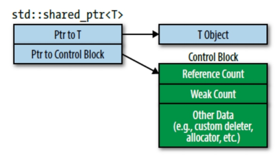
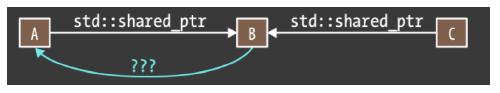

# Smart Ptr

## Item18:对于独占资源使用 std::unique_ptr

std::unique_ptr 体现了专有所有权语义。一个 non-null std::unique_ptr 始终有其指向的内容。移动操作将所有权从源指针转移到目的指针，拷贝操作是不允许的，因为如果你能拷贝一个 std::unique_ptr ，你会得到指向相同内容的两个 std::unique_ptr ，每个都认为自己拥有资源，销毁时就会出现重复销毁。因此，std::unique_ptr 只支持移动操作。当 std::unique_ptr 销毁时，其指向的资源也执行析构函数。而原始指针需要显示调用 delete 来销毁指针指向的资源。
std::unique_ptr 常用在继承层次结构中工厂函数的返回类型：

```cpp
class Investment { ... };
class Sock: public Investment {...};
class Bond: public Investment {...};
class RealEstate: public Investment {...};
// 这种继承关系的工厂函数在堆上分配一个对象然后返回指针，调用方在不需要的时候，销毁对象
template<typename... Ts>
std::unique_ptr<Investment>
makeInvestment(Ts&&... params);
{
    ...
    auto pInvestment = makeInvestment(arguments);
    ...
} //destroy *pInvestment 出作用域销毁

```

可以在所有权转移的场景中使用它，比如将工厂返回的 std::unique_ptr 移入容器中，然后将容器元素移入对象的数据成员中，然后对象随即被销毁。发生这种情况时，并且销毁该对象将导致销毁从工厂返回的资源，对象 std::unique_ptr 的数据成员也被销毁。
还可以自定义 std::unique_ptr 在销毁时调用的函数：

```cpp
auto delInvmt = [](Investment* pInvestment) // 销毁前打印日志
{
    makeLogEntry(pInvestment);
    delete pInvestment;
};
template<typename... Ts>
std::unique_ptr<Investment, decltype(delInvmt)>
makeInvestment(Ts&& params)
{
    std::unique_ptr<Investment, decltype(delInvmt)> pInv(nullptr, delInvmt);
    if (/*a Stock object should be created*/)
    {
        pInv.reset(new Stock(std::forward<Ts>(params)...));
    }
    else if ( /* a Bond object should be created */ )
    {
        pInv.reset(new Bond(std::forward<Ts>(params)...));
    }
    else if ( /* a RealEstate object should be created */ )
    {
        pInv.reset(new RealEstate(std::forward<Ts>(params)...));
    }
    return pInv;
}
```

使用了 unique_ptr 意味着你不需要考虑在资源释放时的路径，以及确保只释放一次，std::unique_ptr 解决了这一问题。

- delInvmt 是自定义的从 makeInvestment 返回的析构函数。所有的自定义的析构行为接受要销毁对象的原始指针，然后执行销毁操作。如上例子。使用 lambda 创建 delInvmt 是方便的，而且，正如稍后看到的，比编写常规的函数更有效
- 当使用自定义删除器时，必须将其作为第⼆个参数传给 std::unique_ptr 。对于 decltype。（decltype 查看[item3](deducing_types.md)）
- makeInvestment 的基本策略是创建一个空的 std::unique_ptr ，然后指向一个合适类型的对象，然后返回。
- 尝试将原始指针（比如 new 创建）赋值给 std::unique_ptr 通不过编译，因为不存在从原始指针到智能指针的隐式转换。这种隐式转换会出问题，所以禁止。这就是为什么通过 reset 来传递 new 指针的原因
- 使用 new 时，要使用 std::forward 作为参数来完美转发给 makeInvestment （std::forward 查看[Item25](rvalue_references%26more.md)）。这使调用者提供的所有信息可用于正在创建的对象的构造函数
- 自定义删除器的参数类型是 Investment* ，尽管真实的对象类型是在 makeInvestment 内部创建的，它最终通过在 lambda 表达式中，作为 Investment* 对象被删除。这意味着我们通过基类指针删除派生类实例，为此，基类必须是虚函数析构：

```cpp
class Investment {
public:
    ...
    virtual ~Investment();
    ...
};
// c++14
template<typename... Ts>
auto makeInvestment(Ts&& params)
{
    auto delInvmt = [](Investment* pInvestment)
    {
        makeLogEntry(pInvestment);
        delete pInvestment;
    };
    std::unique_ptr<Investment, decltype(delInvmt)> pInv(nullptr, delInvmt);
    if (/*a Stock object should be created*/)
    {
        pInv.reset(new Stock(std::forward<Ts>(params)...));
    }
    else if ( /* a Bond object should be created */ )
    {
        pInv.reset(new Bond(std::forward<Ts>(params)...));
    }
    else if ( /* a RealEstate object should be created */ )
    {
        pInv.reset(new RealEstate(std::forward<Ts>(params)...));
    }
    return pInv;
}
```

当使用默认删除器时，你可以合理假设 std::unique_ptr 和原始指针大小相同。当自定义删除器时，情况可能不再如此。删除器是个函数指针，通常会使 std::unique_ptr 的字节从一个增加到两个。对于删除器来说，大小取决于函数对象中存储的状态多少，无状态函数对象（比如没有捕获的 lambda 表达式）对大小没有影响，这意味当自定义删除器可以被 lambda 实现时，尽量使用 lambda

```cpp
auto delInvmt = [](Investment* pInvestment)
{
    makeLogEntry(pInvestment);
    delete pInvestment;
};
template<typename... Ts>
std::unique_ptr<Investment, decltype(delInvmt)>
makeInvestment(Ts&& params); //返回Investment*的大小

void delInvmt2(Investment* pInvestment)
{
    makeLogEntry(pInvestment);
    delete pInvestment;
}
template<typename... Ts>
std::unique_ptr<Investment, void(*)(Investment*)>
makeInvestment(Ts&&... params); //返回Investment*的指针加⾄少一个函数指针的大小
```

工厂函数不是 std::unique_ptr 的唯一常见用法。作为实现 Pimpl Idiom 的一种机制，它更为流行，见[Item22](#item22当使用-pimpl-惯用法请在实现⽂件中定义特殊成员函数)

数组的 std::unique_ptr 的存在应该不被使用，因为 std::array ,std::vector , std::string 这些更好用的数据容器应该取代原始数组。

std::unique_ptr 可以方便地转化为 std::shared_ptr, 通过返回 std::unique_ptr ，工厂为调用者提供了最有效的智能指针，但它们并不妨碍调用者用其更灵活的替换它。

```cpp
std::shared_ptr<Investment> sp = makeInvestment(arguments);
```

## Item18-remember

- std::unique_ptr 是轻量级、快速的、只能 move 的管理专有所有权语义资源的智能指针
- 默认情况，资源销毁通过 delete，但是支持⾃定义 delete 函数。有状态的删除器和函数指针会增加 std::unique_ptr 的大小
- 将 std::unique_ptr 转化为 std::shared_ptr 是简单的

## Item19:对于共享资源使用 std::shared_ptr

std::shared_ptr 可以让多个 std::shared_ptr 指向一个对象，std::shared_ptr 通过引用计数来确保它是否是最后一个指向某种资源的指针，引用计数关联资源并跟踪有多少 std::shared_ptr 指向该资源。 std::shared_ptr 构造函数递增引用计数值，析构函数递减值，拷贝赋值运算符可能递增也可能递减值。（如果 sp1 和 sp2 是 std::shared_ptr 并且指向不同对象，赋值运算符 sp1=sp2 会使 sp1 指向 sp2 指向的对象。直接效果就是 sp1 引用计数减一，sp2 引用计数加一。）如果 std::shared_ptr 发现引用计数值为零，没有其他 std::shared_ptr 指向该资源，它就会销毁资源。

shared_ptr 的性能代价：

- shared_ptr 维护了两个指针，一个指向实例，一个指向**控制块**，所以他的大小是普通指针的两倍
- 引用计数需要动态分配，所以使用 shared_ptr 构造时需要两次动态分配内存，使用 make_shared 只用分配一次内存
- 为适用多线程场景，递增递减引用计数必须是原子性的
- shared_ptr 支持对同一类型的对象自定义销毁器

在进行移动构造的时候，由于之前的指针要置空，新的 std::shared_ptr 指向资源，所以引用计数不变。

shared_ptr 也支持对象自定义销毁器，但是对于 std::unique_ptr 来说，销毁器
类型是智能指针类型的一部分。对于 std::shared_ptr 则不是：

```cpp
// 自定义销毁器
auto loggingDel = [](Widget *pw)
{
    makeLogEntry(pw);
    delete pw;
};
std::unique_ptr<Widget, decltype(loggingDel)> upw(new Widget,loggingDel); //对于同一对象，不同类型的销毁器，是不同类型
std::shared_ptr<Widget> spw(new Widget, loggingDel);

// 这样的设计也使std::shared_ptr更加灵活
auto customDeleter1 = [](Widget *pw) { … };
auto customDeleter2 = [](Widget *pw) { … };
std::shared_ptr<Widget> pw1(new Widget, customDeleter1);
std::shared_ptr<Widget> pw2(new Widget, customDeleter2);
// pw1 pw2可以放在同一类型的容器中，它们也能相互赋值，也可以传入形参为 std::shared_ptr<Widget> 的函数。
std::vector<std::shared_ptr<Widget>> vpw{ pw1, pw2 };
```

std::shared_ptr 由原始指针和控制块指针构成：

- 由于使用控制块，不同于 std::unique_ptr 的地方是，指定自定义销毁器不会改变 std::shared_ptr 对象的大小。不管销毁器是什么，一个 std::shared_ptr 对象都是两个指针大小.
- shared_ptr 内存分配如下所示，控制块中包含引用计数，弱引用，销毁器等
  

控制块的创建遵循以下几条规则：

- make_shared 只能通过对象的参数构造，所以 std::make_shared 总是创建一个控制块（详见[Item21](#item21优先考虑使用-stdmakeunique-和-stdmakeshared-而非-new)）。它创建一个指向新对象的指针，所以可以肯定 std::make_shared 调用时对象不存在其他控制块。
- 当从独占指针上构造出 std::shared_ptr 时会创建控制块
- 当从原始指针上构造出 std::shared_ptr 时会创建控制块，而用 std::shared_ptr 或者 std::weak_ptr 作为构造函数实参创建 std::shared_ptr 不会创建新控制块，因为它可以依赖传递来的智能指针指向控制块。

下述代码当从原始指针上构造超过一个 std::shared_ptr 时，多个智能指针析构时会对 pw 指向的内存进行两次释放，发生错误

```cpp
auto pw = new Widget; // pw是原始指针
…
std::shared_ptr<Widget> spw1(pw, loggingDel); // 为*pw创建控制块
…
std::shared_ptr<Widget> spw2(pw, loggingDel); // 为*pw创建第⼆个控制块
```

- 由于上述原因，构建 shared_ptr 时对对象进行实例化，创建 spw2 时使用 spw1 构建即可：

```cpp
std::shared_ptr<Widget> spw1(new Widget, loggingDel);// 直接使用new的结果
std::shared_ptr<Widget> spw2(spw1); // spw2使用spw1一样的控制块

// 或者使用 make_shared 进行构建

auto spw1 = std::make_shared<Widget>();
```

- 当需要将对象的 this 当作 shared_ptr 使用时，std::shared_ptr 会由此为指向的对象（ \*this ）创建一个控制块，若果在成员函数外早已存在指向该对象的 shared_ptr，则在析构时会像上文中一样被析构两次，发生错误，所以该对象需要继承 std::enable_shared_from_this<Widget>（模板类），并使用 shared_from_this()返回一个 shared_ptr 仅增加引用计数，不创建控制块；同时为了防止客户端在调用 std::shared_ptr 前先调用 shared_from_this，需要把该对象的构造函数放在 private 中，通过工厂模式构建，这要该类仅能构造成 shared_ptr 而不是普通指针。

```cpp
// 错误的
std::vector<std::shared_ptr<Widget>> processedWidgets;
class Widget {
public:
    …
    void process();
    …
};
void Widget::process()
{
    … // 处理Widget
    processedWidgets.emplace_back(this); // 然后将他加到已处理过的Widget的列表中。这是错的！
}

class Widget: public std::enable_shared_from_this<Widget> {
public:
    // 完美转发参数的工厂方法，将构造函数设置为private
    template<typename... Ts>
    static std::shared_ptr<Widget> create(Ts&&... params); // 返回shared_ptr
    …
    void process(); // 和前⾯一样
    …
private:
    …
};
void Widget::process()
{
    // 和之前一样，处理Widget
    …
    // 把指向当前对象的shared_ptr加入processedWidgets
    processedWidgets.emplace_back(shared_from_this());
}
```

通常控制块的实现使用继承，里面还有一个虚函数（用来确保指向的对象被正确销毁）。所以对于 std::shared_ptr 的开销需要考虑：动态分配控制块，任意大小的销毁器和分配器，虚函数机制，原子引用计数修改。

在通常情况下， std::shared_ptr 创建控制块会使用默认销毁器和默认分配器，控制块只需三个 word 大小。它的分配基本上是无开销的。（开销被并入了指向的对象的分配成本里。细节参见[Item21](#item21优先考虑使用-stdmakeunique-和-stdmakeshared-而非-new)）。对 std::shared_ptr 解引用的开销不会比原始指针高。执行原子引用计数修改操作需要承担一两个原子操作开销，这些操作通常都会一一映射到机器指令上，所以即使对比非原子指令来说，原子指令开销较大，但是它们仍然只是单个指令。对于每个被 std::shared_ptr 指向的对象来说，控制块中的虚函数机制产生的开销通常只需要承受一次，即对象销毁的时候。

作为这些轻微开销的交换，你得到了动态分配的资源的生命周期⾃动管理的好处。大多数时候，比起手动管理，使用 std::shared_ptr 管理共享性资源都是非常合适的。

std::shared_ptr 不能处理的另一个东西是数组。和 std::unique_ptr 不同的是，std::shared_ptr 的 API 设计之初就是针对单个对象的，没有办法 std::shared_ptr<T[]> 。尽管使用自定义的删除器进行 delete[]的操作可以通过编译，但是还有一些问题：

- std::shared_ptr 没有提供 operator[] 重载，所以数组索引操作需要借助怪异的指针算术。
- std::shared_ptr 支持转换为指向基类的指针，这对于单个对象来说有效，但是当用于数组类型时相当于在类型系统上开洞。（出于这个原因， std::unique_ptr 禁止这种转换。）

## Item19-remember

- std::shared_ptr 为任意共享所有权的资源一种自动垃圾回收的便捷方式。
- 较之于 std::unique_ptr ， std::shared_ptr 对象通常大两倍，控制块会产生开销，需要原子引用计数修改操作。
- 默认资源销毁是通过 delete，但是也支持自定义销毁器。销毁器的类型是什么对于 std::shared_ptr 的类型没有影响。
- 避免从原始指针变量上创建 std::shared_ptr

## Item20:当 std::shard_ptr 可能悬空时使用 std::weak_ptr

std::weak_ptr 通常从 std::shared_ptr 上创建。当从 std::shared_ptr 上创建 std::weak_ptr 时两者指向相同的对象，但是 std::weak_ptr 不会影响所指对象的引用计数：

```cpp
auto spw = // after spw is constructed
std::make_shared<Widget>(); // the pointed-to Widget's
                            // ref count(RC) is 1
                            // See Item 21 for in on std::make_shared
…
std::weak_ptr<Widget> wpw(spw); // wpw points to same Widget as
                                // spw. RC remains 1
…
spw = nullptr; // RC goes to 0, and the
               // Widget is destroyed.
               // wpw now dangles
// std::weak_ptr使用expired测试指针是否为空
if (wpw.expired()) … // if wpw doesn't point to an object
```

通常在检查完 std::weak_ptr 是否失效后，若没失效还需要访问其指向的对象，若需要将两步分开还需要进行加锁操作，合成一个原子操作可以通过使用 std::weak_ptr 创建 std::shared_ptr 实现：

```cpp
std::shared_ptr<Widget> spw1 = wpw.lock(); // if wpw's expired,
                                           // spw1 is null
auto spw2 = wpw.lock(); // same as above, but uses auto
```

或是以 std::weak_ptr 为实参创建 std::shared_ptr:

```cpp
std::shared_ptr<Widget> spw3(wpw); // if wpw's expired, throw
                                   // std::bad_weak_ptr
```

- 考虑⼀个工厂函数，它基于⼀个 UID 从只读对象上产出智能指针。根据[Item18](#item18对于独占资源使用-stduniqueptr)的描述，工厂函数会返回⼀个该对象类型的 std::unique_ptr ：

```cpp
std::unique_ptr<const Widget> loadWidget(WidgetID id);
```

如果调用 loadWidget 是⼀个昂贵的操作（⽐如它操作⽂件或者数据库 I/O）并且对于 ID 来重复使用很常⻅，⼀个合理的优化是再写⼀个函数除了完成 loadWidget 做的事情之外再缓存它的结果。当请求获取⼀个 Widget 放在缓存操作上这本⾝也会导致性能问题（缓存越来越多），所以另⼀个合理的优化可以是当 Widget 不再使用的时候销毁它的缓存。

缓存对象的指针需要知道它是否已经悬空，因为当工厂客户端使用完工厂产⽣的对象后，对象将被销毁，关联的缓存条⽬会悬空。所以缓存应该使用 std::weak_ptr ，这可以知道是否已经悬空。这意味着工厂函数返回值类型应该是 std::shared_ptr ，因为只有当对象的⽣命周期由 std::shared_ptr 管理时，std::weak_ptr 才能检测到悬空。

```cpp
std::shared_ptr<const Widget> fastLoadWidget(WidgetID id)
{
    static std::unordered_map<WidgetID,
    std::weak_ptr<const Widget>> cache;
    auto objPtr = cache[id].lock(); // objPtr is std::shared_ptr
                                    // to cached object
                                    // (or null if object's not in cache)
    if (!objPtr) { // if not in cache
        objPtr = loadWidget(id); // load it
        cache[id] = objPtr; // cache it
    }
    return objPtr;
}
```

- std::weak_ptr 的第二个使用场景：观察者设计模式。此模式的主要组件是 subjects（状态可能会更改的对象）和 observers（状态发⽣更改时要通知的对象）。在⼤多数实现中，每个 subject 都包含⼀个数据成员，该成员持有指向其 observer 的指针。这使 subject 很容易发布状态更改通知。subject 对控制 observers 的⽣命周期（例如，当它们被销毁时）没有兴趣，但是 subject 对确保 observers 被销毁时，不会访问它具有极⼤的兴趣 。⼀个合理的设计是每个 subject 持有其 observers 的 std::weak_ptr ，因此可以在使用前
  检查是否已经悬空。

- 作为最后⼀个使用 std::weak_ptr 的例⼦，考虑⼀个持有三个对象 A、B、C 的数据结构，A 和 C 共享 B 的所有权，因此持有 std::shared_ptr ：
  
- 原始指针：使用这种⽅法，如果 A 被销毁，但是 C 继续指向 B，B 就会有⼀个指向 A 的悬空指针。而且 B 不知道指针已经悬空，所以 B 可能会继续访问，就会导致未定义⾏为。
- std::shared_ptr：这种设计，A 和 B 都互相持有对⽅的 std::shared_ptr ，导致 std::shared_ptr 在销毁时出现循环。即使 A 和 B ⽆法从其他数据结构被访问（⽐如，C 不再指向 B），每个的引用计数都是 1。如果发⽣了这种情况，A 和 B 都被泄露：程序⽆法访问它们，但是资源并没有被回收。
- std::weak_ptr：这避免了上述两个问题。如果 A 被销毁，B 还是有悬空指针，但是 B 可以检查。尤其是尽管 A 和 B 互相指向，B 的指针不会影响 A 的引用计数，因此不会导致⽆法销毁。

使用 std::weak_ptr 显然是这些选择中最好的。但是，需要注意使用 std::weak_ptr 打破 std::shared_ptr 循环并不常⻅。在严格分层的数据结构⽐如树，⼦节点只被⽗节点持有。当⽗节点被销毁时，⼦节点就被销毁。从⽗到⼦的链接关系可以使用 std::unique_ptr 很好的表征。从⼦到⽗的反向连接可以使用原始指针安全实现，因此⼦节点的⽣命周期肯定短于⽗节点。因此⼦节点解引用⼀个悬垂的⽗节点指针是没有问题的。

从效率⻆度来看， std::weak_ptr 与 std::shared_ptr 基本相同。两者的⼤小是相同的，使用相同的控制块（参⻅ Item 19），构造、析构、赋值操作涉及引用计数的原⼦操作，控制块上有 weak_ptr 的计数

## Item20-remember

- 像 std::shared_ptr 使用 std::weak_ptr 可能会悬空。
- std::weak_ptr 的潜在使用场景包括：caching、observer lists、打破 std::shared_ptr 指向循环

## Item21:优先考虑使用 std::make_unique 和 std::make_shared 而非 new

三个 make functions 中的两个 std::make_unique 和 std::make_shared 通过接收抽象参数，完美转发
到构造函数去动态分配⼀个对象，然后返回这个指向这个对象的指针实现。例如一个简单的 make_unique:

```cpp
template<typename T, typename... Ts>
std::unique_ptr<T> make_unique(Ts&&... params)
{
    return std::unique_ptr<T>(new T(std::forward<Ts>(params)...));
}
```

第三个 make function 是 std::allocate_shared. 它和 std::make_shared ⼀样，除了第⼀个参数是用来动态分配内存的对象。

对使用和不使用 make 函数创建智能指针进行简单的⽐较：

```cpp
auto upw1(std::make_unique<Widget>()); // with make func
std::unique_ptr<Widget> upw2(new Widget); // without make func
auto spw1(std::make_shared<Widget>()); // with make func
std::shared_ptr<Widget> spw2(new Widget); // without make func
```

- 使用 new 的版本重复了类型，但是 make function 的版本没有，应该避免重复代码。源代码中的重复增加了编译的时间，会导致⽬标代码冗余，并且通常会让代码库使用更加困难。
- 使用 make function 的原因和异常安全有段，假设函数：

  ```cpp
  void processWidget(std::shared_ptr<Widget> spw, int priority);
  // 使用new进行调用
  processWidget(std::shared_ptr<Widget>(new Widget), computePriority()); //potential resource leak!
  ```

  这段代码可能在 new Widget 时发⽣泄露，这和编译器将源码转换为⽬标代码有关。在运⾏时，⼀个函数的参数必须先被计算，才能被调用，所以在调用 processWidget 之前，必须执⾏以下操作，processWidget 才开始执⾏：

  1. 表达式'new Widget'必须计算，例如,⼀个 Widget 对象必须在堆上被创建
  2. 负责管理 new 出来指针的 std::shared_ptr<Widget> 构造函数必须被执⾏
  3. computePriority()必须运⾏

  编译器不需要按照执⾏顺序⽣成代码。“new Widget"必须在 std::shared_ptr 的构造函数被调用前执⾏，因为 new 出来的结果作为构造函数的参数，但 compute Priority 可能在这之前，之后，或者之间执⾏。也就是说，编译器可能按照这个执⾏顺序⽣成代码：

  1. 执⾏ new Widget
  2. 执⾏ computePriority
  3. 运⾏ std::shared_ptr 构造函数

  如果按照这样的顺序执行，而 computePriority 出现异常，Widget 就会泄漏，而使用 std::make_shared 就可以防止，因为 std::make_shared 将 new Widget 和 std::shared_ptr 放在了一起，不管 std::make_shared 和 computePriority 谁先执行都不会出现问题。std::unique_ptr 和 std::make_unique 也是如此。

- 使用 std::shared_ptr 使效率更高（静态大小，执行速度）：std::allocate_shared 同理
  ```cpp
  std::shared_ptr<Widget> spw(new Widget); // 分配两次内存，new 一次 构建 shared_ptr 构建控制块一次
  auto spw(std::make_shared<Widget>()); // 分配一次内存，在构建 shared_ptr 时一次构建对象和控制块
  ```

但有时 make function 不应该被使用：

- make 函数不能自定义虚构函数，而普通的 std::shared_ptr, std::unique_ptr 可以：
  ```cpp
  auto widgetDeleter = [](Widget*){...};
  std::unique_ptr<Widget, decltype(widgetDeleter)>
  upw(new Widget, widgetDeleter);
  std::shared_ptr<Widget> spw(new Widget, widgetDeleter);
  ```
- make 函数第⼆个限制来⾃于其单⼀概念的句法细节。[Item7](./moving2modern_cpp.md) 解释了，当构造函数重载，有 std::initializer_list 作为参数和不用其作为参数时，用⼤括号创建对象更倾向于使用 std::initializer_list 作为参数的构造函数，而用圆括号创建对象倾向于不用 std::initializer_list 作为参数的构造函数。make 函数会将它们的参数完美转发给对象构造函数，但是它们是使用圆括号还是⼤括号?
  ```cpp
  auto upv = std::make_unique<std::vector<int>>(10, 20);
  auto spv = std::make_shared<std::vector<int>>(10, 20);
  ```
  上述两种调用都创建了 10 个元素，每个值为 20，这意味着在 make 函数中，完美转发使用圆括号，而不是⼤括号。如果你想用⼤括号初始化指向的对象，你必须直接使用 new。使用 make 函数需要能够完美转发⼤括号初始化，但是，正如[item30](./rvalue_references%26more.md)所说，⼤括号初始化⽆法完美转发。但是，[item30](./rvalue_references%26more.md)介绍了⼀个变通的⽅法：使用 auto 类型推导从⼤括号初始化创建 std::initializer_list 对象(⻅[Item2](./deducing_types.md))，然后将 auto 创建的对象传递给 make 函数。
  ```cpp
  //创建std::initializer_list
  auto initList = { 10, 20 };
  //使用std::initializer_list为形参的构造函数创建std::vector
  auto spv = std::make_shared<std::vector<int>>(initList);
  ```
对于std::unique_ptr只有上述两种情况，而对于std::shared_ptr还有两个问题：
- 一些类重载了operator new和operator delete。这些函数的存在意味着对这些类型的对象的全局内存分配和释放是不合常规的。设计这种定制操作往往只会精确的分配、释放对象大小的内存。例如，Widget类的operator new和operator delete只会处理sizeof(Widget)大小的内存块的分配和释放。这种系列行为不太适用于std::shared_ptr对自定义分配（通过std::allocate_shared）和释放（通过自定义删除器）的支持，因为std::allocate_shared需要的内存总大小不等于动态分配的对象大小，还需要再加上控制块大小。因此，使用make函数去创建重载了operator new和operator delete类的对象是个典型的糟糕想法。

- 与直接使用new相比，std::make_shared在大小和速度上的优势源于std::shared_ptr的控制块与指向的对象放在同一块内存中。当对象的引用计数降为0，对象被销毁（即析构函数被调用）。但是，因为控制块和对象被放在同一块分配的内存块中，直到控制块的内存也被销毁，对象占用的内存才被释放。控制块除了引用计数，还包含簿记信息。引用计数追踪有多少std::shared_ptrs指向控制块，但控制块还有第二个计数，记录多少个std::weak_ptrs指向控制块。第二个引用计数就是weak count。（实际上，weak count的值不总是等于指向控制块的std::weak_ptr的数目，因为库的实现者找到一些方法在weak count中添加附加信息，促进更好的代码产生。为了本条款的目的，我们会忽略这一点，假定weak count的值等于指向控制块的std::weak_ptr的数目。）当一个std::weak_ptr检测它是否过期时（见[Item19](#item19对于共享资源使用-stdsharedptr)），它会检测指向的控制块中的引用计数（而不是weak count）。如果引用计数是0（即对象没有std::shared_ptr再指向它，已经被销毁了），std::weak_ptr就已经过期，否则就没过期。而只要std::weak_ptr引用一个控制块（即weak_count大于零），该控制块必须继续存在，而只要控制块存在，包含它的内存就必须保持分配，通过std::shared_ptr的make函数分配的内存，**直到最后一个std::shared_ptr和最后一个指向它的std::weak_ptr已被销毁，才会释放**（因为整体内存是在一次分配的，而new方法两次分开分配）。
  如果对象类型非常大，而且销毁最后一个std::shared_ptr和销毁最后一个std::weak_ptr之间的时间很长，那么在销毁对象和释放它所占用的内存之间可能会出现延迟：
  ```cpp
  class ReallyBigType { … };

  auto pBigObj =                          //通过std::make_shared
  std::make_shared<ReallyBigType>();      //创建一个大对象
                        
    …           //创建std::shared_ptrs和std::weak_ptrs
                //指向这个对象，使用它们

    …           //最后一个std::shared_ptr在这销毁，
                //但std::weak_ptrs还在

    …           //在这个阶段，原来分配给大对象的内存还分配着

    …           //最后一个std::weak_ptr在这里销毁；
                //控制块和对象的内存被释放

  // 使用new
  class ReallyBigType { … };              //和之前一样

  std::shared_ptr<ReallyBigType> pBigObj(new ReallyBigType);
                                        //通过new创建大对象

  …           //像之前一样，创建std::shared_ptrs和std::weak_ptrs
            //指向这个对象，使用它们
            
  …           //最后一个std::shared_ptr在这销毁,
            //但std::weak_ptrs还在；
            //对象的内存被释放

  …           //在这阶段，只有控制块的内存仍然保持分配

  …           //最后一个std::weak_ptr在这里销毁；
            //控制块内存被释放
  ```
在不可能或不合适使用std::make_shared的情况下，最好的方法是确保在直接使用new时，在一个不做其他事情的语句中，立即将结果传递到智能指针构造函数。这可以防止编译器生成的代码在使用new和调用管理new出来对象的智能指针的构造函数之间发生异常：
```cpp
void processWidget(std::shared_ptr<Widget> spw,     //和之前一样
                   int priority);
void cusDel(Widget *ptr);                           //自定义删除器
processWidget( 									    //和之前一样，
    std::shared_ptr<Widget>(new Widget, cusDel),    //潜在的内存泄漏！
    computePriority() 
);

// 将std::shared_ptr拿出来单独创建，解决问题
std::shared_ptr<Widget> spw(new Widget, cusDel);
processWidget(spw, computePriority());  // 正确，但是没优化，见下

// 优化后，由于非安全操作中传递的是右值，为了确保其性能，使用std::move将左值转化成右值
processWidget(std::move(spw), computePriority());   //高效且异常安全
```

## Item21-remember
- 和直接使用new相比，make函数消除了代码重复，提高了异常安全性。对于std::make_shared和std::allocate_shared，生成的代码更小更快。
- 不适合使用make函数的情况包括需要指定自定义删除器和希望用花括号初始化。
- 对于std::shared_ptrs，其他不建议使用make函数的情况包括(1)有自定义内存管理的类；(2)特别关注内存的系统，非常大的对象，以及std::weak_ptrs比对应的std::shared_ptrs活得更久。

## Item22:当使用 Pimpl 惯用法，请在实现⽂件中定义特殊成员函数
Pimpl（pointer to implementation）惯用法将类数据成员替换成一个指向包含具体实现的类（或结构体）的指针，并将放在主类（primary class）的数据成员们移动到实现类（implementation class）去，而这些数据成员的访问将通过指针间接访问。 举个例子，假如有一个类Widget看起来如下：
```cpp
class Widget() {                    //定义在头文件“widget.h”
public:
    Widget();
    …
private:
    std::string name;
    std::vector<double> data;
    Gadget g1, g2, g3;              //Gadget是用户自定义的类型
};
```
因为类Widget的数据成员包含有类型std::string，std::vector和Gadget， 定义有这些类型的头文件在类Widget编译的时候，必须被包含进来，这意味着类Widget的使用者必须要#include <string>，<vector>以及gadget.h。 这些头文件将会增加类Widget使用者的编译时间，并且让这些使用者依赖于这些头文件。 如果一个头文件的内容变了，类Widget使用者也必须要重新编译。 
如果使用pimpl惯用法：
```cpp
// c++98
class Widget                        //仍然在“widget.h”中
{
public:
    Widget();
    ~Widget();                      //析构函数在后面会分析
    …

private:
    struct Impl;                    //声明一个 实现结构体
    Impl *pImpl;                    //以及指向它的指针
};
```
这时就不需要引用上述头文件。Impl是个未完成类型，即被声明了但是还没有被实现，能对该类型做的事很少，但是声明它的指针是可以的，所以可以进行上述实现。

Pimpl惯用法可以分为两步：
1. 第一步，是声明一个数据成员，它是个指针，指向一个未完成类型。
2. 第二步是动态分配和回收一个对象，该对象包含那些以前在原来的类中的数据成员。

内存分配和回收的代码都写在实现文件里，比如，对于类Widget而言，写在Widget.cpp里:
```cpp
#include "widget.h"             //以下代码均在实现文件“widget.cpp”里
#include "gadget.h"
#include <string>
#include <vector>
// 对于std::string，std::vector和Gadget的头文件的整体依赖依然存在
// 这些依赖从头文件widget.h（它被所有Widget类的使用者包含，并且对他们可见）移动到了
// widget.cpp（该文件只被Widget类的实现者包含，并只对他可见）

struct Widget::Impl {           //含有之前在Widget中的数据成员的
    std::string name;           //Widget::Impl类型的定义
    std::vector<double> data;
    Gadget g1,g2,g3;
};

Widget::Widget()                //为此Widget对象分配数据成员
: pImpl(new Impl)
{}

Widget::~Widget()               //销毁数据成员
{ delete pImpl; }
```
在Widget的构造函数和析构函数中完成对pImpl的空间分配和回收。

相比于c++98中使用的原始指针，std::unique_ptr（见[Item18](#item18对于独占资源使用-stduniqueptr)）是最合适的工具。在头文件中用std::unique_ptr替代原始指针:
```cpp
// widget.h
class Widget {                      //在“widget.h”中
public:
    Widget();
    …

private:
    struct Impl;
    std::unique_ptr<Impl> pImpl;    //使用智能指针而不是原始指针
};

// widget.cpp
#include "widget.h"                 //在“widget.cpp”中
#include "gadget.h"
#include <string>
#include <vector>

struct Widget::Impl {               //跟之前一样
    std::string name;
    std::vector<double> data;
    Gadget g1,g2,g3;
};

Widget::Widget()                    //根据条款21，通过std::make_unique
: pImpl(std::make_unique<Impl>())   //来创建std::unique_ptr
{}
```
根据智能指针的特性，我们不需要手动编写析构函数，因为std::unique_ptr在自身析构时，会自动销毁它所指向的对象，所以我们自己无需手动销毁任何东西，但是上述代码虽然能够编译，但是在构建Widget时却会报错：
```cpp
#include "widget.h"

Widget w;                           //错误！ 一般会提到一些有关于“把sizeof或delete应用到未完成类型上”的信息
```
因为对于未完成类型，使用以上操作是禁止的。在w析构的时候会出现问题，我们在类的定义里使用了std::unique_ptr，所以我们没有声明一个析构函数，因为我们并没有任何代码需要写在里面。根据编译器自动生成的特殊成员函数的规则（见 [Item17](./moving2modern_cpp.md)），编译器会自动为我们生成一个析构函数。 在这个析构函数里，编译器会插入一些代码来调用类Widget的数据成员pImpl的析构函数。 pImpl是一个std::unique_ptr<Widget::Impl>，它使用默认删除器，而默认删除器是一个函数，它使用delete来销毁内置于std::unique_ptr的原始指针。然而，在使用delete之前，通常会使默认删除器使用C++11的特性static_assert来确保原始指针指向的类型不是一个未完成类型。当编译器为Widget w的析构生成代码时，它会遇到static_assert检查并且失败，这通常是错误信息的来源。这些错误信息只在对象w销毁的地方出现，因为类Widget的析构函数，正如其他的编译器生成的特殊成员函数一样，是暗含inline属性的。错误信息自身往往指向对象w被创建的那行，因为这行代码明确地构造了这个对象，导致了后面潜在的析构。

所以我们需要把析构函数放到pImpl定义的后面：
```cpp
// .h
class Widget {                  //跟之前一样，在“widget.h”中
public:
    Widget();
    ~Widget();                  //只有声明语句
    …

private:                        //跟之前一样
    struct Impl;
    std::unique_ptr<Impl> pImpl;
};

// .cpp
#include "widget.h"                 //跟之前一样，在“widget.cpp”中
#include "gadget.h"
#include <string>
#include <vector>

struct Widget::Impl {               //跟之前一样，定义Widget::Impl
    std::string name;
    std::vector<double> data;
    Gadget g1,g2,g3;
}

Widget::Widget()                    //跟之前一样
: pImpl(std::make_unique<Impl>())
{}

Widget::~Widget()                   //析构函数的定义（译者注：这里高亮）
{}
// or
Widget::~Widget() = default;
```
由于定义了析构函数，所以还需要定义移动函数，而默认的移动函数一样存在和析构函数一样的问题，如果放在.h文件中，会因为要销毁原有pImpl指向的对象，所以他们的定义也要放到.cpp中实现：
```cpp
// .h
class Widget {                          //仍然在“widget.h”中
public:
    Widget();
    ~Widget();

    Widget(Widget&& rhs);               //只有声明
    Widget& operator=(Widget&& rhs);
    …

private:                                //跟之前一样
    struct Impl;
    std::unique_ptr<Impl> pImpl;
};

//.cpp
#include <string>                   //跟之前一样，仍然在“widget.cpp”中
…
    
struct Widget::Impl { … };          //跟之前一样

Widget::Widget()                    //跟之前一样
: pImpl(std::make_unique<Impl>())
{}

Widget::~Widget() = default;        //跟之前一样

Widget::Widget(Widget&& rhs) = default;             //这里定义
Widget& Widget::operator=(Widget&& rhs) = default;

// 也需要定义深拷贝函数
Widget::Widget(const Widget& rhs)   //拷贝构造函数
: pImpl(std::make_unique<Impl>(*rhs.pImpl))
{}

Widget& Widget::operator=(const Widget& rhs)    //拷贝operator=
{
    *pImpl = *rhs.pImpl;
    return *this;
}
```
如果使用std::shared_ptr就不会有这样的问题：
```cpp
class Widget {                      //在“widget.h”中
public:
    Widget();
    …                               //没有析构函数和移动操作的声明

private:
    struct Impl;
    std::shared_ptr<Impl> pImpl;    //用std::shared_ptr
};                                  //而不是std::unique_ptr
Widget w1;
auto w2(std::move(w1));     //移动构造w2
w1 = std::move(w2);         //移动赋值w1
```
这些都能编译，并且工作地如我们所望：w1将会被默认构造，它的值会被移动进w2，随后值将会被移动回w1，然后两者都会被销毁（因此导致指向的Widget::Impl对象一并也被销毁）。

std::unique_ptr和std::shared_ptr在pImpl指针上的表现上的区别的深层原因在于，他们支持自定义删除器的方式不同。 对std::unique_ptr而言，**删除器的类型是这个智能指针的一部分**，这让编译器有可能生成更小的运行时数据结构和更快的运行代码。 这种更高效率的后果之一就是std::unique_ptr指向的类型，在编译器的生成特殊成员函数（如析构函数，移动操作）被调用时，必须已经是一个完成类型。 而对std::shared_ptr而言，**删除器的类型不是该智能指针的一部分**，这让它会生成更大的运行时数据结构和稍微慢点的代码，但是当编译器生成的特殊成员函数被使用的时候，指向的对象不必是一个完成类型。
## Item22-remember
- Pimpl惯用法通过减少在类实现和类使用者之间的编译依赖来减少编译时间。
- 对于std::unique_ptr类型的pImpl指针，需要在头文件的类里声明特殊的成员函数，但是在实现文件里面来实现他们。即使是编译器自动生成的代码可以工作，也要这么做。
- 以上的建议只适用于std::unique_ptr，不适用于std::shared_ptr。